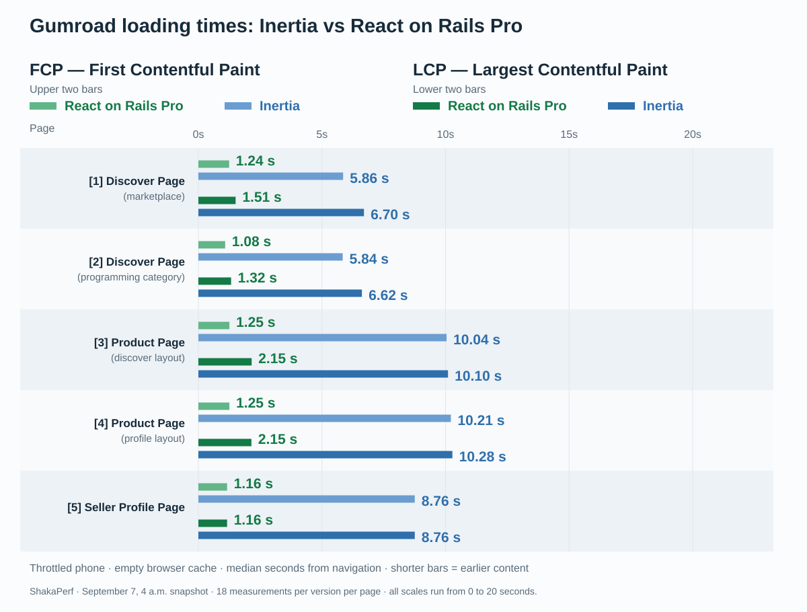
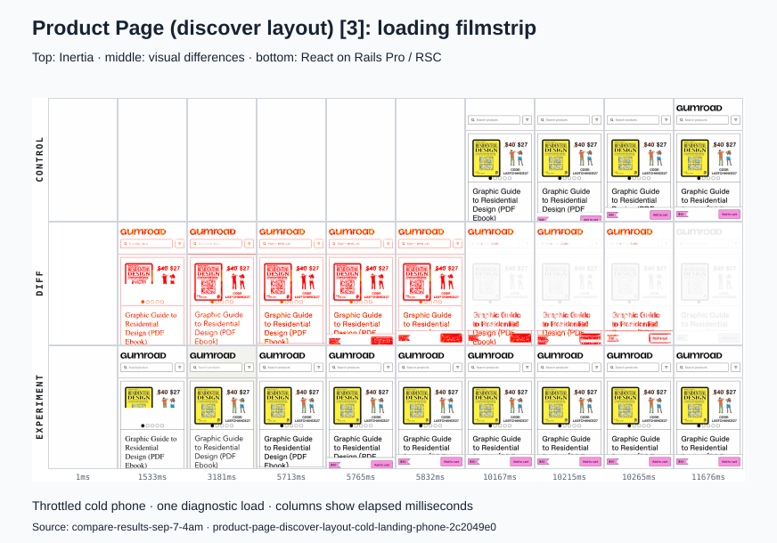
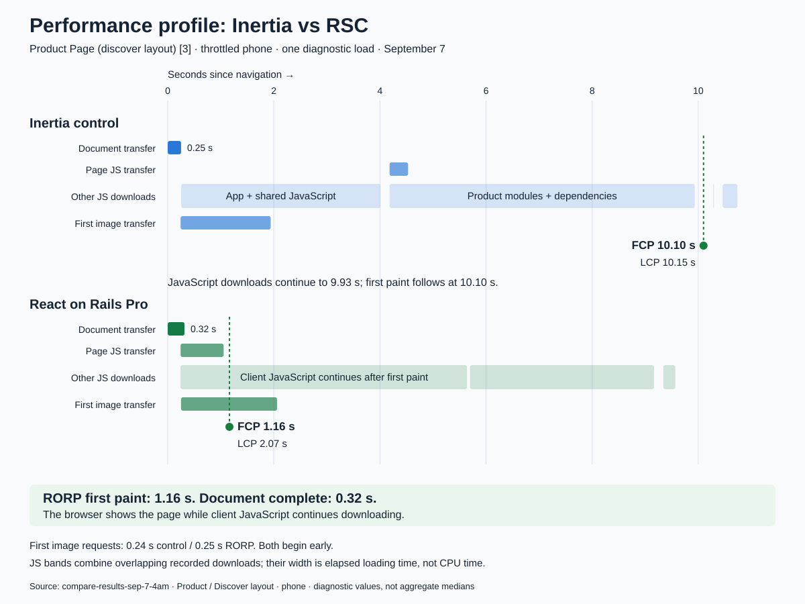
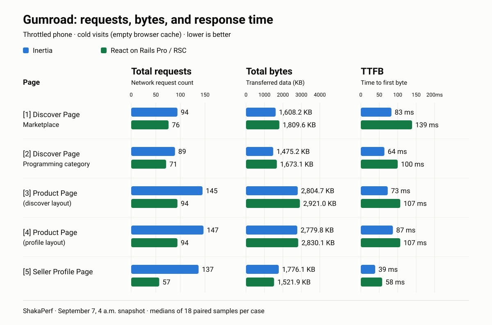
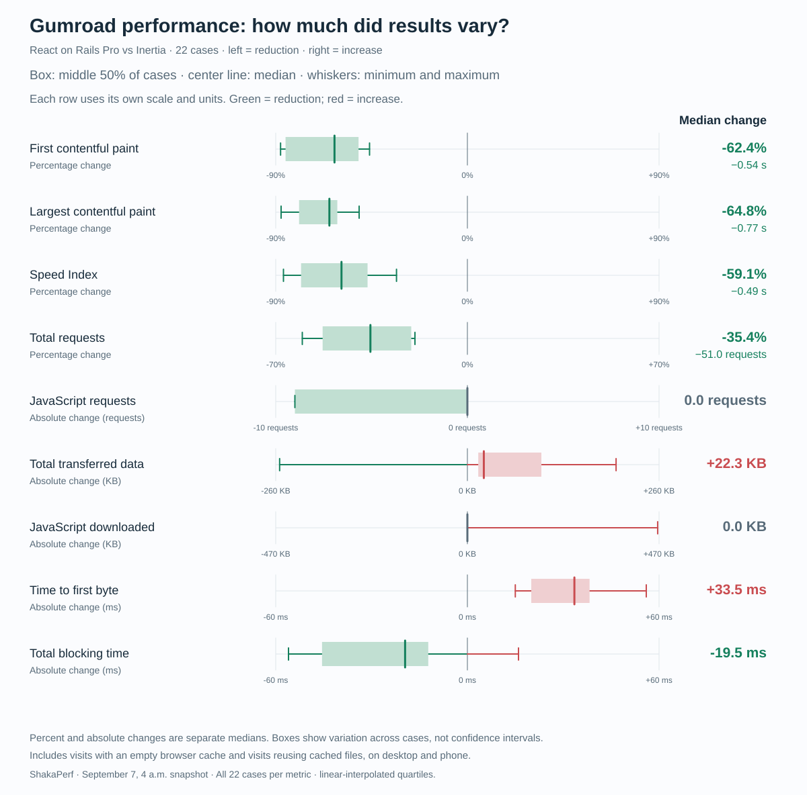
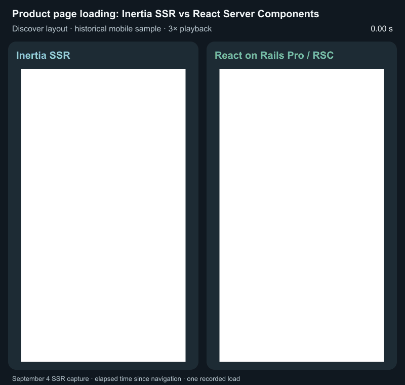

# Gumroad Product performance appendix

Supporting measurements and historical comparisons for the [Product-page article](index.md).

## Measured trade-offs

These results are from the September 23 profile-layout Product comparison used in the main article.

[See the September 23 measurements](benchmark-data/latest-results.md).

## Earlier comparisons across Gumroad pages

Earlier work covered Discover page, both Product layouts, and seller profiles. Its September 7 snapshot tested 11 scenarios on Desktop and Mobile, with 18 paired measurements per case. These graphs are copied from that worktsream; their scope and code differ from the September 23 Product-only comparison, later on we isolated the changes to the product page only to minimize code changes.

### Loading sequence

Both versions started downloading images early, but Inertia still had to load and run its page JavaScript before showing content. React on Rails Pro began streaming server-rendered content while JavaScript continued downloading, bringing first paint forward from 10.10 seconds to 1.16 seconds in this sample.

### Transfer and server-response costs

Earlier content did not always mean a smaller download. On Discover, a visit with no files cached in the browser downloaded more JavaScript and more data overall. The server also took longer to start responding on several pages. React on Rails Pro adds a renderer service to deploy, monitor, and provision.

### Results across the historical suite

The chart summarizes the middle change across cases, not an average; the boxes also show how widely those changes varied. FCP, LCP, and total requests improved in every case; download and server costs varied by page. A zero median for JavaScript bytes does not mean every page downloaded the same amount.

The diagnostic Lighthouse profile used DevTools throttling: 100 ms RTT, 2,700 Kbps download/upload, 200 ms request latency, and a 3× CPU slowdown.

[Inspect the historical measurements and correctness findings](https://github.com/shakacode/gumroad/blob/c3ccc2090dc6e31fff2985d5d9cb881faa526221/ab-test-results/latest-results.md).

## What about Inertia SSR?

We tested an optimized Inertia SSR implementation too. Both approaches could show server-rendered content early but the difference in hydration speed was significant. In this test, the sticky **Add to cart** bar began appearing at **10.97 seconds with React Server Components** and **21.38 seconds with Inertia SSR**. It was fully visible at **11.02 seconds** and **21.43 seconds**, respectively—about **10.4 seconds earlier with RSC**.

This was a separate September 4 comparison for a cold visit. Both versions used the same DevTools throttling: 150 ms RTT, 562.5 ms request latency, 1,474.56 Kbps download, 675 Kbps upload, and a 4× CPU slowdown. These settings were stricter than the September 23 run, and the implementation also differed, so the numbers are not directly comparable.

