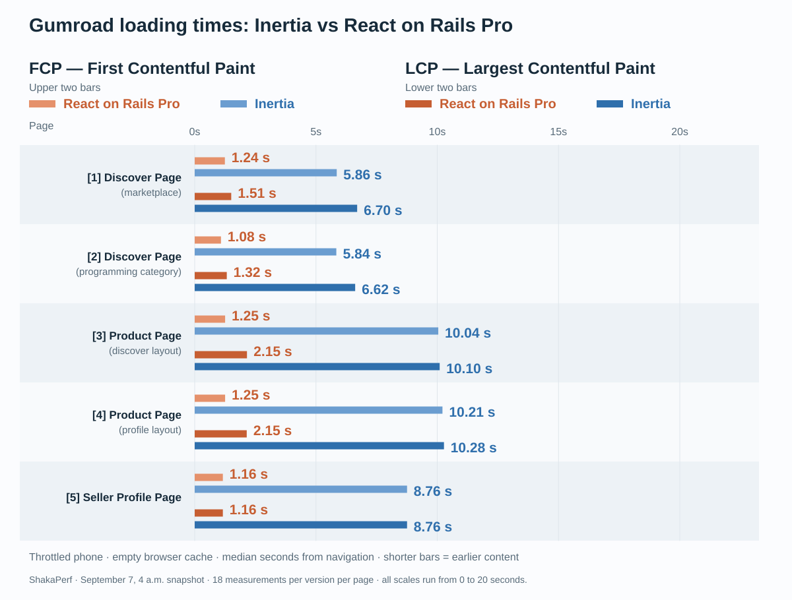
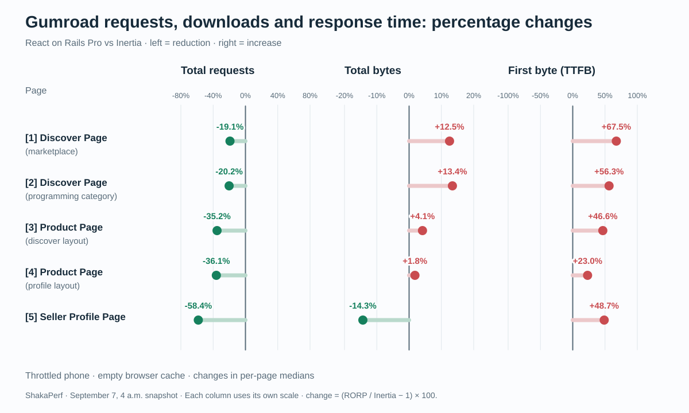
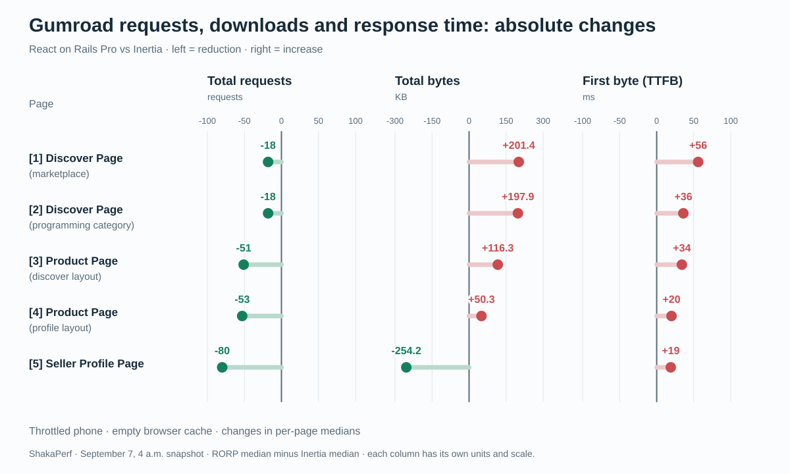
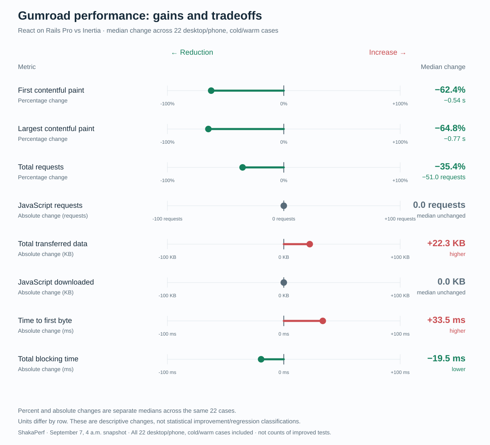
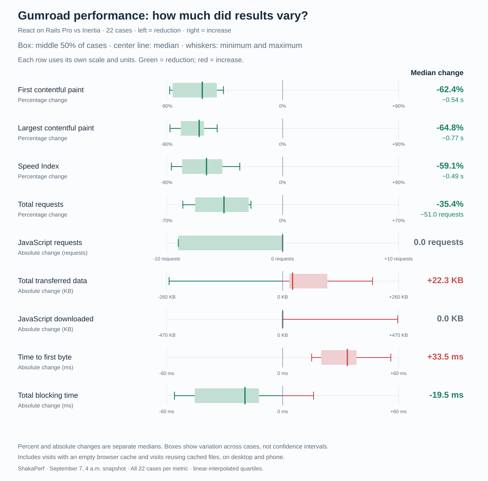
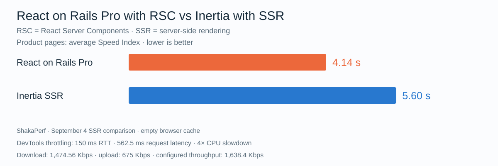

# We made Gumroad’s Product content appear 8× faster with React on Rails Pro

By Justin Gordon, CEO of ShakaCode · September 2026

Could React 19 Server Components make Gumroad’s public pages appear sooner while keeping Inertia in the application?

We used [ShakaPerf](https://shakaperf.com/) to migrate and measure the core public pages in [Gumroad’s](https://gumroad.com/) codebase to [React on Rails Pro](https://www.shakacode.com/react-on-rails-pro/), with React 19 and Server Components. Rails kept the business logic, Inertia was kept in place. We changed how those pages reached the browser, making these pages load substantially faster.

Try the [1-5] pages for yourself in the [live deployments below](#try-the-live-deployments-with-lighthouse). · [Throttling settings](#throttling-settings)

## Watch both versions load

**[▶ Open the interactive side-by-side replay](product-discover-phone-replay/timeline_replay.html)** for the Product Page (discover layout) on phone.

[Throttling settings](#throttling-settings)

## Here is how we did this

Ramez Weissa added React on Rails Pro with React 19 and Server Components to three types of Gumroad page. Rails kept routing and business logic; Inertia continued serving the rest of the application.

On a fresh visit, the tested Inertia implementation had to download and execute its page JavaScript before React could render the content. React on Rails Pro streamed server-rendered content while JavaScript continued loading. Making that possible took component restructuring, not just a rendering switch:

| Page           | How we changed it                                                                                                                                                                                                                |
| -------------- | -------------------------------------------------------------------------------------------------------------------------------------------------------------------------------------------------------------------------------- |
| Seller Profile | Added server streaming around much of the existing client page. Most of the existing page remained in client components; we changed how it was delivered rather than splitting it extensively into server and client components. |
| Discover       | Moved the page shell and recommendation regions to the server, letting recommendations stream independently while search and other interactions stayed client-side.                                                              |
| Product        | Substantially split the page into server-rendered content and layout, and client components for commerce interactions. This meant reorganizing existing components and their shared state.                                       |

Inertia’s strength is navigation after the first load, when it can reuse JavaScript already running in the browser. React on Rails Pro brings the benefit earlier: on a fresh visit, it delivers rendered content while JavaScript is still loading.

The work is organized into reviewable changes:

[Explore the PR stack](https://github.com/shakacode/gumroad/pulls?q=is%3Apr)

1. **Add ShakaPerf** — our A/B testing tool for comparing web performance, checking visual differences, and running accessibility checks across two implementations.
2. **Add React on Rails Pro and React 19** — introduce server rendering alongside Inertia.
3. **Split server and client components** — move initial content to the server while keeping interactions client-side.

## Where the loading time went

[Throttling settings](#throttling-settings). \[3\] Open the [Product Page][page-3].

Both versions started downloading images early, but Inertia still had to load and run its page JavaScript before showing content. React on Rails Pro began streaming server-rendered content while JavaScript continued downloading, bringing first paint forward from 10.03 seconds to 1.23 seconds in this sample.”

## Earlier content costs and caveats

Try the [1-5] pages for yourself in the [live deployments below](#try-the-live-deployments-with-lighthouse). · [Throttling settings](#throttling-settings)

**Alternative A — percentage changes (gallery #3)**

Try the [1-5] pages for yourself in the [live deployments below](#try-the-live-deployments-with-lighthouse). · [Throttling settings](#throttling-settings)

**Alternative B — changes in requests, KB and milliseconds (gallery #3a)**

Try the [1-5] pages for yourself in the [live deployments below](#try-the-live-deployments-with-lighthouse). · [Throttling settings](#throttling-settings)

Earlier content did not always mean a smaller download. On Discover, a visit with no files cached in the browser downloaded more JavaScript and more data overall. Even when the browser reused files from a previous visit, the new page response often carried more HTML or Server Component data. Fewer requests can still mean more bytes, And yet with the larger download size. It still loads earlier.

The server also took longer to start responding on several pages. Yet content appeared sooner because the browser no longer had to finish loading and running the page’s JavaScript before displaying it. The benefit came from changing when content could appear, not from making every part of the load smaller or faster.

React on Rails Pro also adds a renderer service to deploy, monitor, and provision. Those costs belong alongside the browser gains in an adoption decision.

## How we measured the results

[ShakaPerf](https://shakaperf.com/) compared the existing Inertia implementation (the **control**) with React on Rails Pro and Server Components (the **experiment**), using matching seeded content in isolated application containers. Each pair started both versions simultaneously in isolated Docker Containers.

We tested 11 scenarios on desktop and phone, repeating each comparison 18 times per device size to reduce the influence of normal run-to-run variation. Cold visits started with an empty browser cache; warm visits reused cached files from an earlier visit but still loaded a full page. The suite also captured visual differences and accessibility checks.

The [benchmark summary](latest-results.md) includes the complete measurements, visual-check findings, source hashes, and report links.

> Test reference: September 4, 8 a.m. run. The diagnostic Lighthouse profile used DevTools throttling: 100 ms RTT, 2,700 Kbps download/upload, 200 ms request latency, and 3× CPU slowdown.

## What changed across all 22 cases

[Throttling settings](#throttling-settings)

**Alternative — candlestick-style boxes**

[Throttling settings](#throttling-settings)

The charts summarize the middle change across cases, not an average; the boxes also show how widely those changes varied. FCP, LCP, and total requests improved in every case; download and server costs varied by page. A zero median for JavaScript bytes does not mean every page downloaded the same amount.

## Try the live deployments with Lighthouse

Open the same page in each deployment:

| Page                                       | Inertia                                                                                                          | React on Rails Pro                                                                                            |
| ------------------------------------------ | ---------------------------------------------------------------------------------------------------------------- | ------------------------------------------------------------------------------------------------------------- |
| \[1\] Discover Page (marketplace)          | [Open page](https://gumroad-inertia.reactonrails.com/discover)                                                   | [Open page](https://gumroad-rorp.reactonrails.com/discover)                                                   |
| \[2\] Discover Page (programming category) | [Open page](https://gumroad-inertia.reactonrails.com/software-development/programming)                           | [Open page](https://gumroad-rorp.reactonrails.com/software-development/programming)                           |
| \[3\] Product Page (discover layout)       | [Open page](https://luisfurushio.gumroad-inertia.reactonrails.com/l/bgfjk?layout=discover&recommended_by=search) | [Open page](https://luisfurushio.gumroad-rorp.reactonrails.com/l/bgfjk?layout=discover&recommended_by=search) |
| \[4\] Product Page (profile layout)        | [Open page](https://luisfurushio.gumroad-inertia.reactonrails.com/l/bgfjk?layout=profile&recommended_by=search)  | [Open page](https://luisfurushio.gumroad-rorp.reactonrails.com/l/bgfjk?layout=profile&recommended_by=search)  |
| \[5\] Seller Profile Page                  | [Open page](https://shakaperfprofile.gumroad-inertia.reactonrails.com/)                                          | [Open page](https://shakaperfprofile.gumroad-rorp.reactonrails.com/)                                          |

In Chrome DevTools, choose **Lighthouse → Navigation → Performance**. Enable **Clear storage** for a cold visit and keep device and throttling settings identical. Alternate between versions over several runs and compare medians.

These are seeded test deployments. Your results will depend on your machine, location, network, and Lighthouse settings.

## Why not just enable SSR in Inertia?

We tested an optimized Inertia SSR implementation too. SSR may have narrowed the gap, but React on Rails Pro still achieved a **26% better average Speed Index** on the Product-page tests under tougher throttling. Speed Index measures how quickly visible content fills in; lower is better.

**[▶ Watch a sample side-by-side loading comparison for the Product page](inertia-ssr-product-phone-replay/timeline_replay.html)**

## What you should take from this

If you build with Rails and React, [React on Rails Pro](https://www.shakacode.com/react-on-rails-pro/) brings React 19 Server Components and streaming to your application. You can deliver rendered content while JavaScript is still loading.

Already using Inertia? You can introduce this approach on selected pages without replacing it across your app. That is what we did in our Gumroad fork: content appeared sooner on the pages we migrated, while the rest of the application stayed on Inertia. Start where visitors are left waiting, and keep what already works.

Start measuring your app’s performance now with [ShakaPerf](https://shakaperf.com/). Compare changes against your existing app to see what actually makes it faster, while checking for visual differences and accessibility issues. Run tests locally as you optimize, then in CI to catch regressions before they ship. The [ShakaPerf repository](https://github.com/shakacode/shakaperf) shows how to get started.

Want to find that opportunity in your application? We at ShakaCode can help choose the page, set up ShakaPerf, and implement [React on Rails Pro](https://www.shakacode.com/react-on-rails-pro/) incrementally. Bring us a page that feels slow, and let’s measure what we can improve together.

Aloha, Justin

[page-1]: https://gumroad-rorp.reactonrails.com/discover
[page-2]: https://gumroad-rorp.reactonrails.com/software-development/programming
[page-3]: https://luisfurushio.gumroad-rorp.reactonrails.com/l/bgfjk?layout=discover&recommended_by=search
[page-4]: https://luisfurushio.gumroad-rorp.reactonrails.com/l/bgfjk?layout=profile&recommended_by=search
[page-5]: https://shakaperfprofile.gumroad-rorp.reactonrails.com/
