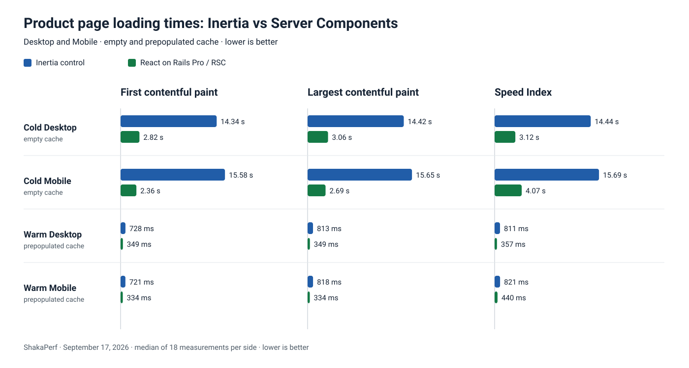
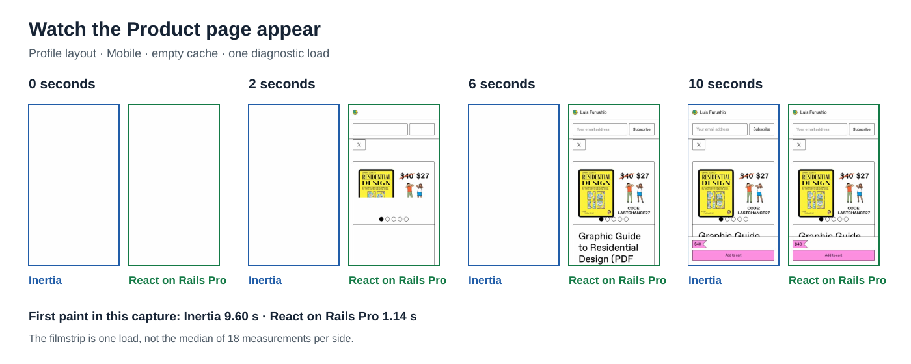
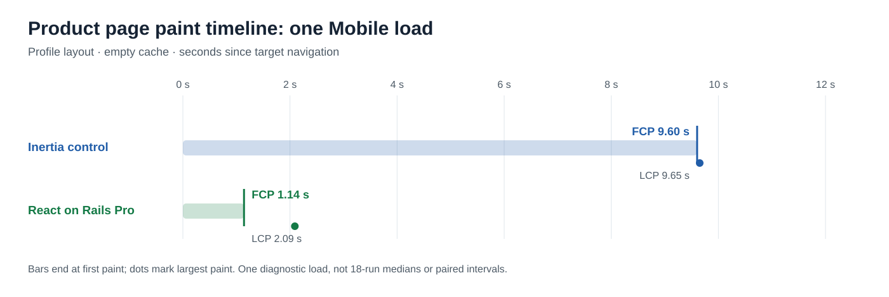
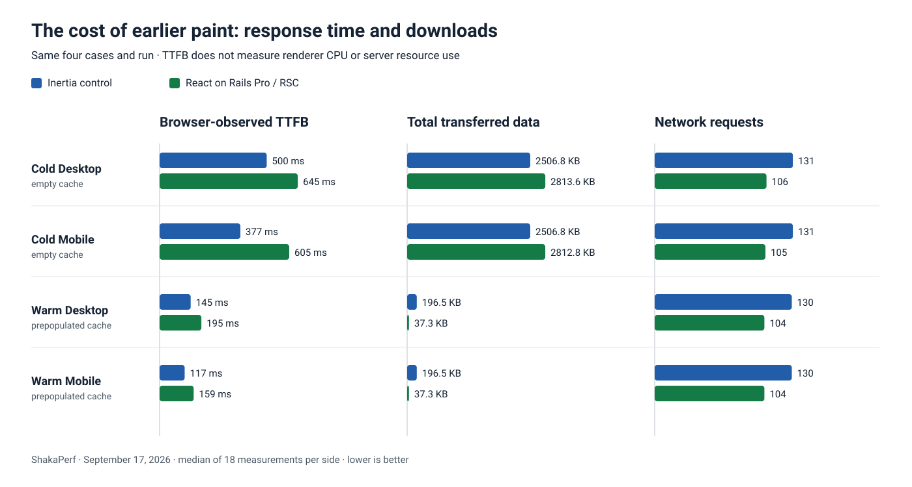
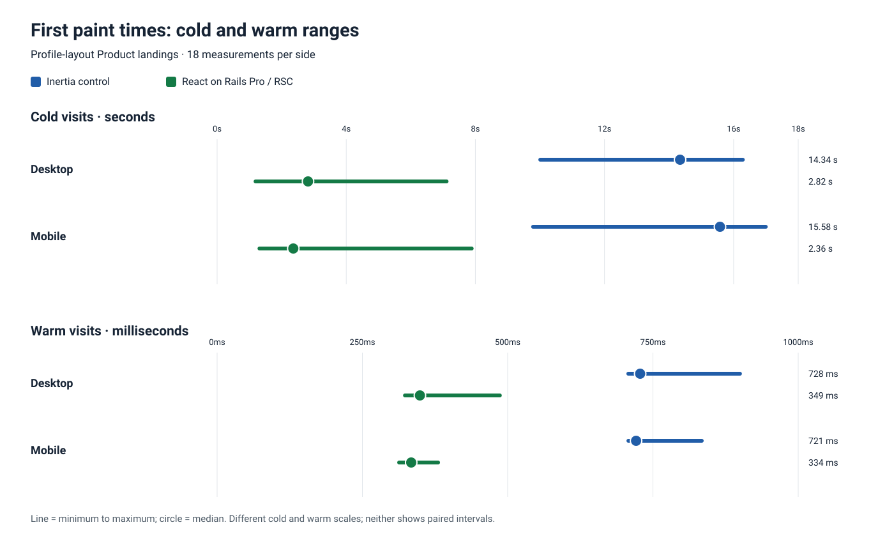

# Gumroad’s profile-layout Product page showed content sooner with React 19 Server Components

By Justin Gordon, CEO of ShakaCode · September 2026

Could React 19 Server Components make a Gumroad Product page appear sooner while keeping Inertia in the application?

We used [ShakaPerf](https://shakaperf.com/) to compare the existing Inertia Product page with a [React on Rails Pro](https://www.shakacode.com/react-on-rails-pro/) version. Rails kept the product and purchase logic. The rest of the application stayed on Inertia. In the latest run, the profile-layout Product page painted sooner with Server Components on Desktop and Mobile, both with an empty cache and with a prepopulated cache. This measures the **complete page-delivery path**, not a React 18-versus-React 19 upgrade in isolation.

The cold-visit median First Contentful Paint (FCP) fell from **14.34 to 2.82 seconds on Desktop** and from **15.58 to 2.36 seconds on Mobile**. With cached files, it fell from **728 to 349 milliseconds on Desktop** and from **721 to 334 milliseconds on Mobile**. These are medians of 18 measurements per side, not the paired improvement estimates.

[See the measurements](benchmark-data/latest-results.md) · [See the test settings](#throttling-settings)

## Watch both versions load

**[▶ Open the interactive side-by-side replay](product-profile-phone-replay.html)** for one cold Mobile load of the profile-layout Product page.

The replay is **one diagnostic capture**, not the 18-measurement result. Its FCP was 9.60 seconds for Inertia and 1.14 seconds for Server Components. Use the replay to inspect the loading sequence; use the repeated measurements for the performance estimate. [See the test settings](#throttling-settings).

## Here is how we did this

We moved the profile-layout Product page’s content and layout into Server Components. Buyers can reach this page directly, so its initial load matters. The page keeps purchase and other commerce interactions in client components. React on Rails Pro streams the server-rendered output to the browser, while Rails still owns the product and purchase logic. A seller feature flag selects this route for the profile-layout Product URL; turning it off restores the Inertia page.

On a fresh visit, the tested Inertia path sent page data and then relied on browser JavaScript to render the Product content. The new path could show server-rendered content while JavaScript continued loading. This took a server/client split in the Product components, not just a rendering switch. [React documents Server Components](https://react.dev/reference/rsc/server-components) and the [React 19 release](https://react.dev/blog/2024/12/05/react-19). Streaming server rendering also existed before React 19; the benchmark does not attribute the entire gain to the React version.

Inertia can reuse already-running JavaScript during client-side navigation. Our warm test still used a **full page navigation** with cached files, not an Inertia client-side transition. Discover pages, seller profiles, and the Product page’s Discover layout are outside this result.

## Page loading timeline

In this capture, React on Rails Pro reached first paint at 1.14 seconds and Inertia at 9.60 seconds. Both times use the target navigation as their origin. The chart and replay come from the same low-noise diagnostic capture; they do not represent the four cases’ medians or paired confidence intervals. The [source timeline and Lighthouse reports](benchmark-data/timeline-replay/replay-manifest.json) are linked from the replay.

## Earlier content costs and caveats

Earlier paint did not make every metric better. On cold visits, median browser-observed Time to First Byte (TTFB) rose from 500 to 645 milliseconds on Desktop and from 377 to 605 milliseconds on Mobile. Total transferred data rose by about 12% in both cold cases. With a prepopulated cache, transferred data fell from about 197 KB to 37 KB, or about 81%. TTFB does not measure renderer CPU time or total server cost; a production rollout would also need to operate the renderer service.

The source report classified JavaScript-specific transferred bytes as zero on both sides despite visible JavaScript requests. We make no JavaScript-byte claim from that category. Cold visual checks found zero differing pixels in the Product article area on Desktop and Mobile. Warm visual comparisons were not captured. The run also reported changed accessibility findings that need separate review; visual parity does not establish accessibility parity.

## How we measured the results

[ShakaPerf](https://shakaperf.com/) compared the existing Inertia implementation (the **control**) with the seller-flagged React on Rails Pro and Server Components route (the **experiment**) using matching seeded content in isolated application containers. During article preparation, HTTP responses showed the Inertia Products/Profile/Show entrypoint on control and product-rsc-root with no Inertia entrypoint on experiment. The report does not embed immutable at-run commit identities.

We measured the profile-layout Product cold and warm landing on Desktop (1280 × 800) and Mobile (375 × 667). Each of the four cases has 18 measurements per side. Cold visits started with an empty browser cache; warm visits reused cached files but still loaded a full page. The target hosts, control.localhost and experim.localhost, have equal-length names. The Lighthouse reports show a Desktop user agent on Desktop and a Mobile user agent on Mobile.

The proposed URL-parameter override would let both variants run on one server. It was not part of this measured route, so this comparison used the isolated control and experiment servers.

The [benchmark summary](benchmark-data/latest-results.md) gives FCP, Largest Contentful Paint (LCP), and Speed Index medians and paired estimates with 95% confidence intervals. The [machine-readable data](benchmark-data/latest-results.json) records source hashes and user agents. The [comparison report](../compare-results/self-contained-performance-report.html) holds the complete run. The regeneration scripts select only these four landings; the sticky add-to-cart scenario from the same run contributes no article number or graph.

> Test reference: September 17, 2026 run 2026-09-17T13:21:25.405Z. Lighthouse used DevTools throttling: 100 ms RTT, 2,700 Kbps download and upload, 200 ms request latency, and a 3× CPU slowdown.

The run did not save a time-aligned memory/swap guard record. We cannot call these exact estimates swap-free. If the machine remains under pressure, a clean final publication should repeat the comparison with that guard.

## Performance summary for this Product page

The cold measurements varied much more than the warm ones. The chart shows each side’s minimum, median, and maximum FCP; it is **not** a confidence-interval chart. ShakaPerf’s paired estimates answer a different question and cannot be calculated by subtracting the displayed medians. For cold Desktop FCP, the paired estimate was **−10.81 seconds** (95% confidence interval: −11.56 to −9.16 seconds), or **−75.4%**. For cold Mobile FCP, it was **−11.42 seconds** (−13.39 to −10.45 seconds), or **−73.3%**. The [four-case table](benchmark-data/latest-results.md) includes all three paint metrics and their paired intervals.

## Want to test performance for yourself?

Open the [control Lighthouse report](../compare-results/product-page-profile-layout-cold-landing-phone-031456e8/artifacts/control_lighthouse_report.html) and the [experiment Lighthouse report](../compare-results/product-page-profile-layout-cold-landing-phone-031456e8/artifacts/experiment_lighthouse_report.html) for the diagnostic Mobile capture, or inspect the [full comparison report](../compare-results/self-contained-performance-report.html). This run used local twin servers, not the public demo deployments.

To run a new comparison, keep the viewport, user agent, network, CPU profile, cache state, and product content the same on both sides. Check that control serves Products/Profile/Show and experiment serves product-rsc-root before interpreting results. Repeat runs and compare distributions as well as medians.

## What you should take from this

You can introduce Server Components on a selected Product page without replacing Inertia across the application. In this profile-layout Product test, content appeared sooner on both device sizes and cache states. The result is promising, but it belongs with the measured costs, accessibility findings, and machine-load limit—not as a version-only React claim. Start with a page where visitors wait for content, then measure both sides with [ShakaPerf](https://shakaperf.com/) and check what else changes.

Want to evaluate that path in your application? [ShakaCode](https://www.shakacode.com/) can help select the page, set up the comparison, and implement [React on Rails Pro](https://www.shakacode.com/react-on-rails-pro/) incrementally.

Aloha, Justin

---

Historical note: An earlier, broader comparison covered Product, Discover, and seller-profile pages. It also included a separate optimized Inertia SSR comparison. That SSR test used a different implementation, date, and throttling profile; its 5.60-to-4.14-second Product Speed Index figures are not combined with this run. That work also observed earlier interactivity with Server Components in a video, but the present run did not measure time to interactive. It supports no new TTI claim.
