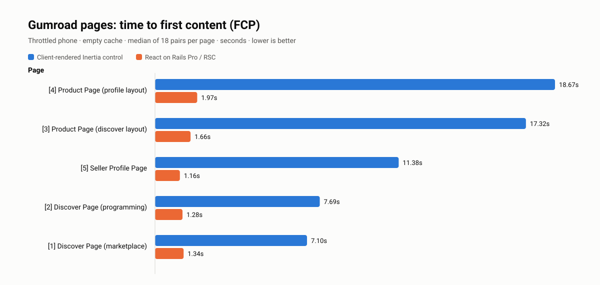
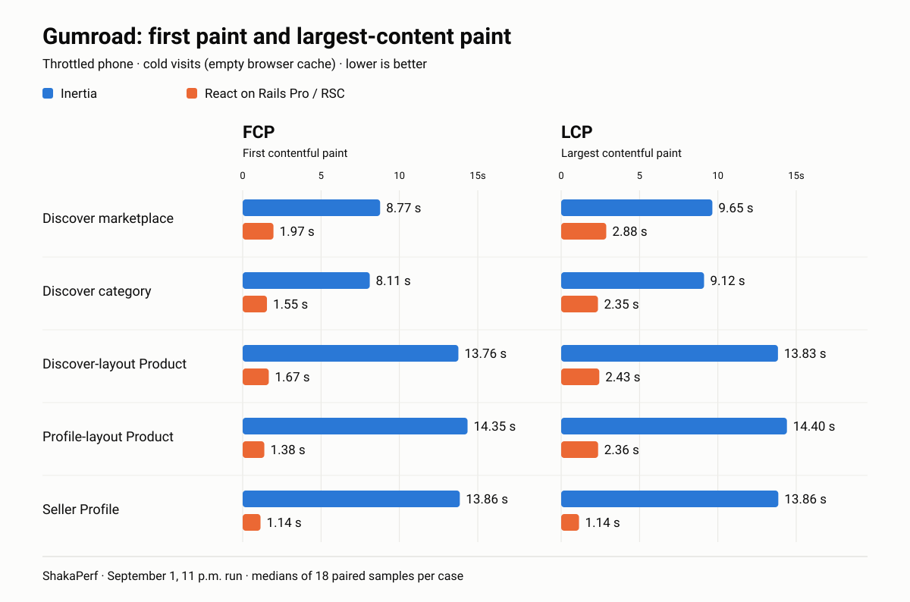
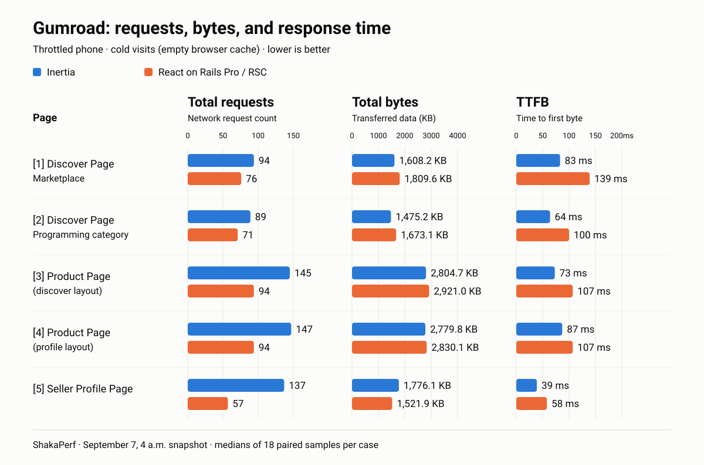
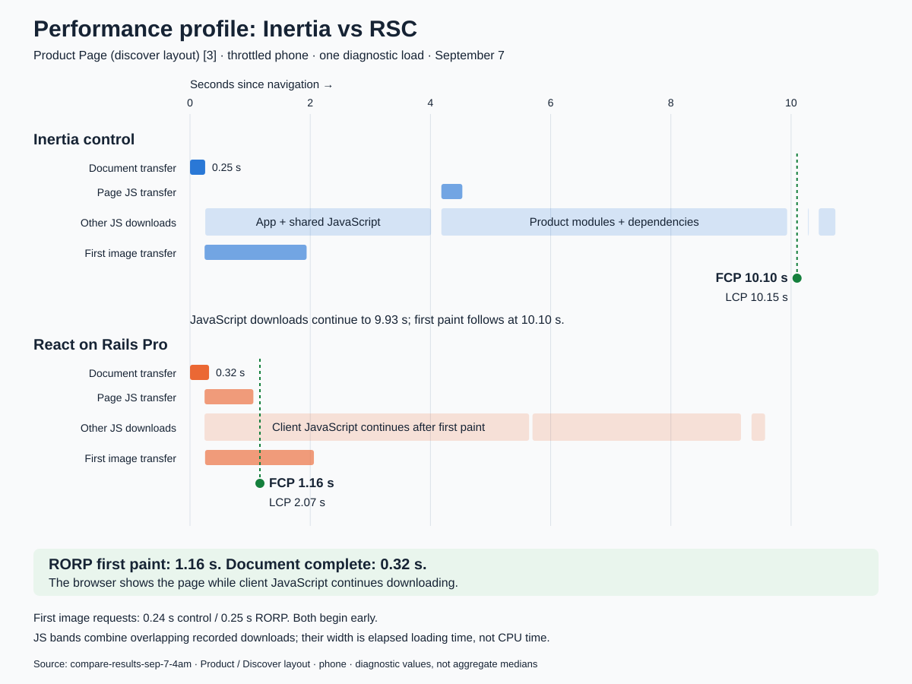
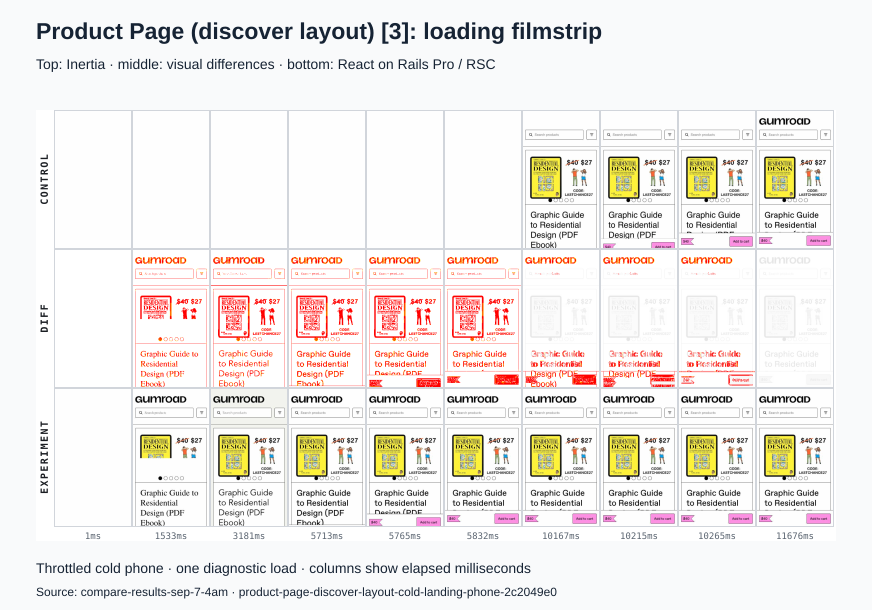
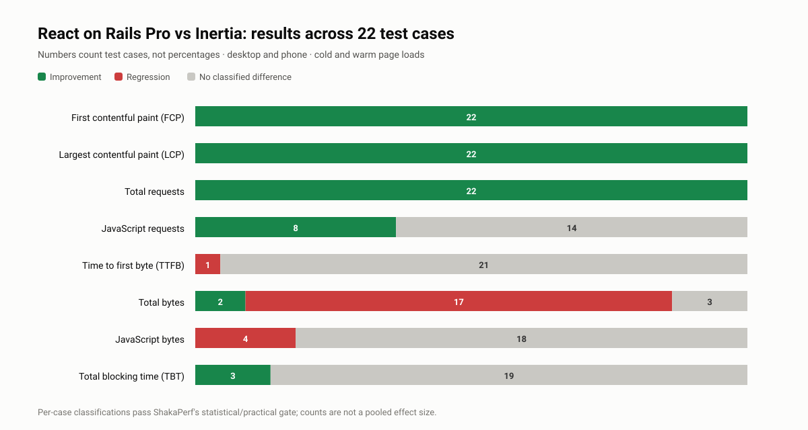

# Gumroad Left React on Rails. Going back cuts Gumroad’s First Paint from 14 Seconds to under 2

By Justin Gordon, CEO of ShakaCode · September 2026

A buyer can leave before your storefront has a chance to make its case. Google's 2016 research found that 53% of mobile visits were abandoned when sites took longer than three seconds to load. In Clutch's 2025 survey, 52% of shoppers said they would leave a website that took more than ten seconds. [Google](https://blog.google/products-and-platforms/products/ads/speed-scorecard-impact-calculator/) · [Clutch survey coverage](https://www.retailbrew.com/stories/2025/09/04/lousy-web-design-may-play-a-huge-role-in-whether-a-customer-shops-with-a-brand-survey)

Gumroad’s [move from React on Rails to Inertia](https://x.com/gumroad/status/2034374288007188817) simplified how its Rails application delivered interactive pages. But a buyer arriving at a storefront has a different immediate need: seeing what is for sale. That raised a question for our team at ShakaCode: could we make those public pages appear sooner while keeping Inertia in the application?

Ramez Weissa took Gumroad’s codebase and added React on Rails Pro with React 19 and Server Components to its Product, Discover, and Seller Profile pages. Rails continued handling the application’s business logic. The change was how those pages reached the browser: the server could begin delivering rendered content while JavaScript continued loading.

We used [ShakaPerf](https://shakaperf.com/), our A/B performance testing system, to compare two versions of Gumroad: the existing client-rendered Inertia implementation (the control) and our React on Rails Pro implementation with React 19 and Server Components (the experiment). Both versions used matching seeded content and ran under the same conditions.

On a throttled phone with no page files saved in the browser’s cache—a “cold” visit—the tested Product page’s first paint fell from nearly 14 seconds to under 2.

First Contentful Paint, or FCP, marks when the browser first draws qualifying text or an image.

## Why the first storefront visit mattered

Gumroad’s Inertia architecture works well once the application is running in the browser: Rails supplies page data, React renders the interface, and later navigation reuses the loaded client runtime. On a cold visit, that client runtime still has to reach the browser.

The Inertia version still had to load its Vite entry and page module and execute the React tree before rendering the page. Some resources could be preloaded earlier, but fetching an image was not enough to make the surrounding Product interface appear.

React on Rails Pro changed the initial delivery path. Rails prepared application data, called a private React renderer, and streamed rendered HTML plus React Server Component payloads. The browser could paint the initial page while client code and the remaining response continued arriving.

## How we tested with ShakaPerf

We used [ShakaPerf](https://shakaperf.com/), ShakaCode’s A/B performance testing system, to compare Gumroad’s existing client-rendered Inertia pages with the React on Rails Pro versions.

Alongside cold visits, we tested “warm” visits: full page loads after an earlier visit had saved reusable files in the browser’s cache. This covered returning to the same page and opening a Seller Profile after visiting a Product page.

Control and experiment ran in isolated Docker containers. Each paired measurement started both sides together. The suite selected 11 scenarios across desktop and phone—22 cases covering cold and warm visits to Product, Discover, and Seller Profile pages. This included visual diff comparisons and accessibility checks, keeping the performance numbers connected to the unchanged page a buyer receives.

> **Reference test profile:** September 1 report; 22 selected cases, 22 valid standard-performance results; 18 simultaneous control/experiment pairs per valid case. The artifact-embedded Lighthouse diagnostic profile uses DevTools throttling with 100 ms RTT, 2,700 Kbps download and upload, 200 ms request latency, and 3× CPU slowdown.

## What changed across Gumroad

We used a different migration depth for each public surface.

On Product pages, the initial buyer-facing composition moved into the streamed server tree while interactive commerce behavior remained in client components. This required splitting the Product page into server components for its initial content and "use client" components for interactive commerce behavior.

Discover used a streamed server shell with independent asynchronous recommendation regions. The shell could arrive while recommendation work continued; search, filtering, cart behavior, and other interactions stayed client-side.

Seller Profile took the smallest step: the new document and streaming path wrapped much of the existing client page. This let us test a different delivery path before deeply restructuring that component tree.

Other requests continued through Inertia and Vite. Rails kept routing, policies, models, and the request lifecycle. RSC and streaming entered at selected document boundaries instead of through a wholesale application migration.

## A/B Test results

For cold phone visits, representative medians from the standard paired measurements were:

Fewer requests did not always mean smaller downloads: both Discover pages transferred more bytes.

Across all 22 successful standard-performance cases:

- FCP improved in every case, with a mean reduction of 68.3% and a range of 39.5% to 91.8%.
- LCP improved in every case, with a mean reduction of 68.6% and a range of 43.7% to 91.8%.
- Total requests improved in every case, with a mean reduction of 36.6% and a range of 19.1% to 60.3%.
- Total transferred bytes increased in 16 of 22 cases. Across those 16 cases, the mean increase was 245.6 KB, ranging from 67.8 to 466.4 KB.

These summaries compare the versions’ medians and give each included case equal weight; they are not pooled paired-effect estimates. The FCP, LCP, and request-count improvements held across both cold and warm visits.

The [generated benchmark summary](latest-results.md) contains the complete case table, classifications, sample counts, and source-file hashes. The [self-contained performance report](self-contained-performance-report.html) includes the correctness checks.

## The browser painted while the document was still streaming

The Product timeline makes the delivery change concrete.

In one throttled diagnostic navigation of the Discover-layout Product phone case, the Inertia version requested its Product page module around 4.19 seconds and reached FCP at 9.97 seconds. The React on Rails Pro version requested its generated Product module around 0.23 seconds and painted at 1.30 seconds.

The React on Rails Pro document did not finish transferring until about 3.99 seconds. Its first paint happened roughly 2.69 seconds before the response ended.

Both sides requested Product images early, at roughly a quarter of a second. Streamed HTML let the React on Rails Pro page paint while the response and client work continued.

ShakaPerf filmstrip from one diagnostic page load.

Explore the [side-by-side replay](product-profile-desktop-replay/timeline_replay.html) of a cold desktop visit to the Profile-layout Product page.

## The costs belong next to the wins

Warm visits often transferred more document or Flight data. Cold Discover visits transferred more JavaScript and total bytes: on phones, JavaScript grew from 918.7 to 1,376.2 KB. TTFB increased enough to classify as a regression in five valid cases, while 17 showed no classified difference. Total bytes improved in six cases and regressed in 16.

Those costs matter when planning caching and renderer capacity. Even with them, FCP, LCP, Speed Index, total requests, and JavaScript requests improved across every valid performance case. Both Product layouts and Seller Profile transferred less JavaScript. The Product trace shows how a page can become visible while its response continues arriving.

React on Rails Pro also adds a renderer service to deploy, secure, monitor, and load-test. That operational work belongs in the adoption decision alongside the browser gains.

These results compare complete implementations under the tested conditions.

## Run Lighthouse on the live Gumroad deployments

Experience the comparison yourself. Our live **gumroad-inertia** and **gumroad-rorp** deployments let you browse matching storefronts and see how each page loads. Start with Discover or the same Product page on both, then run Lighthouse to put numbers behind what you see:

| Surface              | Inertia                                                                                                             | React on Rails Pro                                                                                               |
| -------------------- | ------------------------------------------------------------------------------------------------------------------- | ---------------------------------------------------------------------------------------------------------------- |
| Discover marketplace | [Open Discover](https://gumroad-inertia.reactonrails.com/discover)                                                  | [Open Discover](https://gumroad-rorp.reactonrails.com/discover)                                                  |
| Product page         | [Open Product](https://luisfurushio.gumroad-inertia.reactonrails.com/l/bgfjk?layout=discover&recommended_by=search) | [Open Product](https://luisfurushio.gumroad-rorp.reactonrails.com/l/bgfjk?layout=discover&recommended_by=search) |

For a useful side-by-side comparison:

1. Choose a matching pair of links above. Test one page at a time
2. Choose **DevTools → Lighthouse → Navigation**, select **Performance**, and enable **Clear storage** for a cold visit. Keep the device, throttling, and other settings identical on both sides.
3. Run each side at few times, alternating between Inertia and React on Rails Pro. Compare median FCP, LCP, TBT, and Speed Index, The difference will be significant! We would love to see your paired reports.

These are seeded benchmark deployments. The article’s measurements come from the controlled, throttled ShakaPerf run; your live results will reflect your machine, location, network, and Lighthouse settings.

## What I would take from this

Gumroad’s Inertia migration solved real dashboard problems, and I would not tell them to reverse it. I would tell them, and any team running public pages on Inertia, to measure what a buyer waits for on the first visit. In our tests, streaming cut seconds off first paint, and the improvements held on warm visits too. Those gains came with larger downloads on many pages, higher response times in some cases, and another service to operate.

If you maintain a Rails application on Inertia, start with one public page. Which pages earn their keep on the first visit? Which transitions already feel instant? How much component restructuring would it take to deliver the initial page from the server while keeping interactions in the browser? The answer may be different for your dashboard and your storefronts.

Rails can keep routing and domain logic. Inertia can remain where client navigation works well. React on Rails Pro brings React 19 Server Components and streaming to the pages where you choose to use them. Start with one valuable page, two implementations, and a paired benchmark with [ShakaPerf](https://shakaperf.com/).

We will share more on developer experience and navigation separately. For now, I hope this gives you a more useful starting point than a framework verdict. If your team is weighing where server rendering would help, we at ShakaCode would be happy to work with you: choose a page, introduce React on Rails Pro incrementally, and measure the result in your application.

Aloha, Justin
