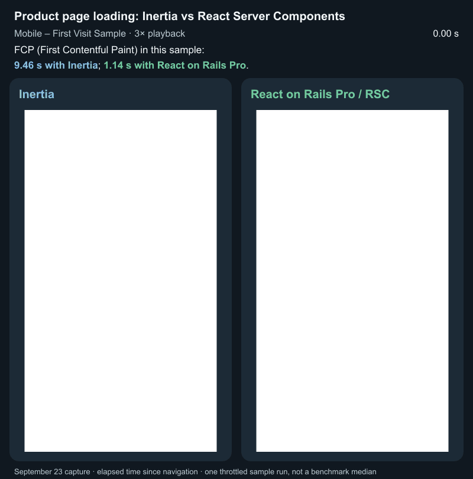
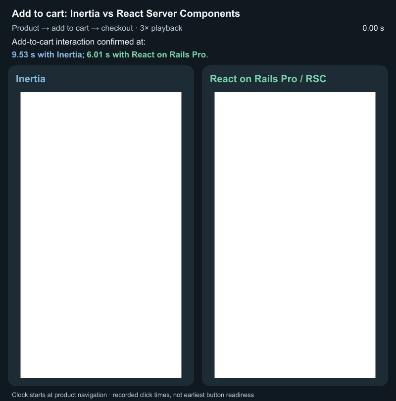

# Gumroad fork: mobile PageSpeed snapshots score 80 with RSC, 53 with Inertia

By Justin Gordon and Ramez Weissa · October 2026

In two October 1 PageSpeed Insights reports, our Gumroad fork scored **53 with Inertia and 80 with React Server Components on mobile**. Those individual lab snapshots use Lighthouse's simulated throttling; their matching application revisions were not recorded. A separate September 23 ShakaPerf comparison used **100 ms RTT, 2,700 Kbps download/upload, 200 ms request latency and 3× CPU slowdown**, with 20 paired measurements per case. The two methods answer different questions; their results should not be combined into one benchmark.

We maintain React on Rails at ShakaCode, and wanted to test an incremental migration on an existing application. We moved Gumroad's profile-layout Product page to React Server Components through [React on Rails Pro](https://reactonrails.com/pro). Rails still owns the business logic, purchase controls remain client components, and the other routes still use Inertia. The [fork](https://github.com/shakacode/gumroad), [implementation](https://github.com/shakacode/gumroad/pull/103) and measurements are public.

**Mobile, first visit — one recorded sample, played at 3× speed:**

On the tested Inertia path, the browser received page data and relied on JavaScript to render Product content. The RSC path streamed server-rendered content while JavaScript continued loading. Interactive purchase controls stayed in client components.

## What the PageSpeed reports show

These are individual lab captures, not averages, a repeated-run range or real-user measurements. Times below are the reports' displayed First Contentful Paint (FCP) and Largest Contentful Paint (LCP) values. Both reports were captured on October 1, 2026; HST is UTC−10.

| Viewport | Variant                  | Performance score |   FCP |    LCP | Capture time (HST) | Report                                                                                                                                       |
| -------- | ------------------------ | ----------------: | ----: | -----: | ------------------ | -------------------------------------------------------------------------------------------------------------------------------------------- |
| Mobile   | Inertia                  |                53 | 7.1 s | 10.8 s | 00:52:10           | [Open report](https://pagespeed.web.dev/analysis/https-luisfurushio-gumroad-inertia-reactonrails-com-l-bgfjk/pktr6lcl65?form_factor=mobile)  |
| Mobile   | React on Rails Pro / RSC |                80 | 2.3 s |  3.6 s | 00:50:38           | [Open report](https://pagespeed.web.dev/analysis/https-luisfurushio-gumroad-rorp-reactonrails-com-l-bgfjk/737osqp6n5?form_factor=mobile)     |
| Desktop  | Inertia                  |                66 | 1.4 s |  2.3 s | 00:52:11           | [Open report](https://pagespeed.web.dev/analysis/https-luisfurushio-gumroad-inertia-reactonrails-com-l-bgfjk/pktr6lcl65?form_factor=desktop) |
| Desktop  | React on Rails Pro / RSC |                98 | 0.6 s |  0.8 s | 00:50:37           | [Open report](https://pagespeed.web.dev/analysis/https-luisfurushio-gumroad-rorp-reactonrails-com-l-bgfjk/737osqp6n5?form_factor=desktop)    |

These snapshots do not establish a controlled before/after result. We cannot verify their at-run source parity. A [later deployment inspection](pagespeed-evidence.md#later-deployment-inspection) found different RSC package versions in the live variants.

PageSpeed is a convenient independent way to inspect these hosted pages. Scores vary with the run and deployment state. The [PageSpeed evidence notes](pagespeed-evidence.md) record the exact timestamps and settings; the repeated local measurements below provide a separate view of the change.

## What the repeated comparison measured

The September 23 ShakaPerf run compared matching seeded Product content in separate Docker environments. Each row below contains 20 measurements per side. The browser used the [same DevTools network and CPU throttling](appendix.md#measured-trade-offs) for first and repeat visits.

| Navigation         | Viewport | Median FCP: Inertia → RSC | Median LCP: Inertia → RSC | Paired FCP reduction (95% CI) |
| ------------------ | -------- | ------------------------: | ------------------------: | ----------------------------: |
| Empty cache        | Desktop  |           9.53 s → 1.16 s |           9.53 s → 2.05 s |            87.8% (87.5–88.2%) |
| Empty cache        | Mobile   |           9.54 s → 1.16 s |           9.54 s → 2.07 s |            87.8% (87.5–88.1%) |
| Prepopulated cache | Desktop  |           715 ms → 334 ms |           715 ms → 334 ms |            52.6% (51.1–53.7%) |
| Prepopulated cache | Mobile   |           708 ms → 326 ms |           708 ms → 326 ms |            53.7% (52.5–55.0%) |

The paired estimate puts the cold FCP reduction at about 8.4 seconds for both viewports. It is computed from differences within measurement pairs, rather than by subtracting the displayed medians. The [full table](benchmark-data/latest-results.md) includes absolute estimates and confidence intervals.

Repeat visits here mean **full-page navigations with cached JavaScript**, still under 3× CPU and network throttling. They do not measure Inertia's client-side navigation, which can reuse already-running JavaScript.

## The costs sit alongside the faster paint

Earlier content did not mean less work in every metric. These cold-visit medians and paired estimates come from the same September 23 run:

| Metric                |  Desktop: Inertia → RSC | Desktop paired change |   Mobile: Inertia → RSC | Mobile paired change |
| --------------------- | ----------------------: | --------------------: | ----------------------: | -------------------: |
| Total Blocking Time   |          11 ms → 119 ms |               +109 ms |          12 ms → 121 ms |              +110 ms |
| Browser-observed TTFB |         131 ms → 156 ms |                +28 ms |         129 ms → 162 ms |               +25 ms |
| Transferred data      | 2,597.9 KB → 2,722.8 KB |             +124.5 KB | 2,597.9 KB → 2,722.0 KB |            +124.4 KB |
| Network requests      |                143 → 96 |                   −47 |                143 → 96 |                  −47 |

With a prepopulated cache, transferred data fell by a paired estimate of **160 KB on each viewport**, and requests fell from 142 to 95. Costs remained: median Total Blocking Time rose from 0 to 50 ms on desktop and from 0 to 42 ms on mobile; paired TTFB increases were 20 and 23 ms respectively. See the [trade-off tables](appendix.md#measured-trade-offs) for confidence intervals.

RSC also adds a Node renderer service. It needs deployment, resource sizing, health checks and monitoring alongside Rails. Browser timings do not measure that operational cost, server capacity or infrastructure spend.

## Watch a purchase interaction

In a separate recorded mobile interaction, the test clicked the sticky **Add to cart** button without scrolling, then continued through the revealed purchase controls to checkout. The click occurred **3.5 seconds earlier with RSC**, measured from the initial Product navigation. This is one recorded interaction, separate from the 20-pair landing measurements; it is not a population estimate of time to interactive. Both paths kept checkout on Inertia.

[Open the interactive add-to-cart replay](product-profile-phone-add-to-cart-replay.html).

## What changed, and what the checks cover

| Area                   | Change                                                                                                                               |
| ---------------------- | ------------------------------------------------------------------------------------------------------------------------------------ |
| Product component tree | Split content rendering from interactive client components.                                                                          |
| Content and layout     | Render with Server Components, streamed through React on Rails Pro.                                                                  |
| Business logic         | Keep it in Rails.                                                                                                                    |
| Rollout and rollback   | Use a seller-scoped feature flag; disabling it restores the Inertia route.                                                           |
| Scope                  | Change Product pages using the profile layout; Discover-layout Products, seller Profiles, checkout and other routes stay on Inertia. |

The captured cold desktop and mobile screenshots had **zero differing pixels**. Warm visual checks were not captured. Screenshot equality covers those views and states; it does not establish correctness for every purchase path or application state.

The cold accessibility comparison found **0 new and 0 fixed findings**. Twenty existing findings were marked changed on each viewport: 19 critical and 1 serious. Inspection of the raw records shows matching failure descriptions; only captured HTML differs, through image URLs, generated IDs or inline-style serialization. The existing accessibility issues remain. Warm accessibility checks were not captured. [Inspect the classification and raw reports](appendix.md#accessibility-findings).

## Inspect the evidence or try the pages

[ShakaPerf](https://github.com/shakacode/shakaperf/) runs the same Playwright scenario against the control and experiment, collecting Lighthouse measurements, screenshots, accessibility findings and network activity. It sampled both sides concurrently in each pair and analyzed the within-pair differences. That reduces sensitivity to shared host activity, but does not eliminate every source of noise. The setup is in [PR #102](https://github.com/shakacode/gumroad/pull/102).

There are two limits to exact reproduction from the published September 23 summary: its hashes identify input files, not the exact application commit tested on each side, and it contains no time-aligned host memory or swap telemetry. We cannot use it to prove the host was free of memory pressure. The [archived artifacts](https://github.com/shakacode/gumroad/tree/f533e7ca1fb9e3cb21a296b8835d373a1858ca9b/compare-results/rorp-2026-09-23) preserve what was measured.

| Demo                     | Product page                                                                                                                      |
| ------------------------ | --------------------------------------------------------------------------------------------------------------------------------- |
| Inertia                  | [Open the Inertia deployment](https://luisfurushio.gumroad-inertia.reactonrails.com/l/bgfjk?layout=profile&recommended_by=search) |
| React on Rails Pro / RSC | [Open the RSC deployment](https://luisfurushio.gumroad-rorp.reactonrails.com/l/bgfjk?layout=profile&recommended_by=search)        |

Live deployments change. The archived reports are evidence for their recorded runs, not proof that today's demos match those builds or each other in every dependency. Deployment sleep, cold starts and current traffic can also affect a new measurement.

To explore either page, open Chrome DevTools and choose **Lighthouse → Navigation → Performance**. Enable **Clear storage** for a first visit, keep the device and settings consistent, and run each variant several times. Record the URLs, timestamps, settings and every result. A local Lighthouse run uses your machine and need not reproduce PageSpeed's score.

## Try one page in your own app

The useful result is the scope of the migration: an application can keep Inertia and introduce RSC on a selected route. Whether that helps your application depends on its page, rendering work and deployment costs. Start with a page whose initial content matters, measure the existing route, and compare the migration under the same conditions.

Follow the [Inertia migration guide](https://reactonrails.com/docs/migrating/migrating-from-inertia-rails) and the [migrating-to-RSC series](https://reactonrails.com/docs/migrating/migrating-to-rsc). Use [ShakaPerf](https://github.com/shakacode/shakaperf) to compare the result and inspect performance, visual and accessibility changes together.

React on Rails core is MIT-licensed. Pro is source-available and free for development, test, CI, staging and review apps, with a 45-day production evaluation per organization. Under the current license, ongoing production use is free for qualifying organizations below **all three** limits—10 paid full-time-equivalent people, $1 million revenue and $1 million lifetime outside capital, counted with affiliates—and for qualifying charities, schools and hospitals. Other production use requires a subscription. The [pricing page](https://reactonrails.com/pricing/) links the authoritative eligibility definitions; use the license terms that apply to your version.

If you want help choosing the page, setting up measurements or making the migration, [talk with ShakaCode](https://www.shakacode.com/react-on-rails-pro/).

## Appendix

- [Measured trade-offs](appendix.md#measured-trade-offs)
- [Raw measurements and evidence](appendix.md#raw-measurements)
