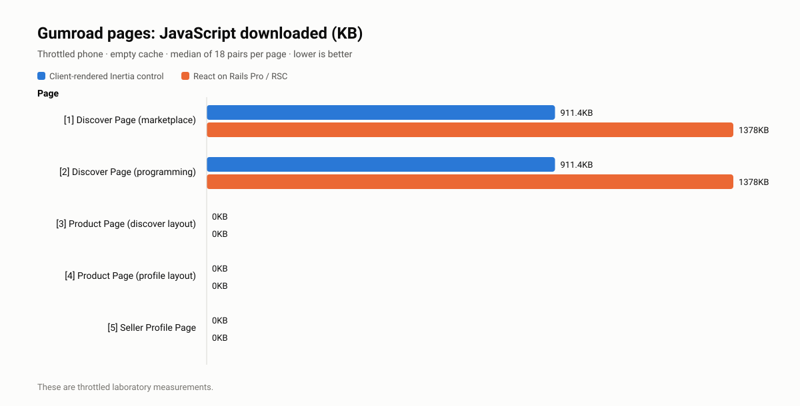

# September 7 Gumroad RORP/RSC benchmark summary

Generated from `compare-results-sep-7-1am` using the [self-contained performance report](self-contained-performance-report.html).

## Provenance

- Source report generated: `2026-09-06T22:09:44.257Z`
- Report-only consolidation: `false`
- Pipeline: `compare`; recorded duration: `4359436` ms; errors: `0`
- Selected cases: `22`
- Successful main-perf cases: `22`; failed main-perf cases: `0`
- Source report SHA-256: `514ac318126aa4eddd3f17c15153b30798d68c5a2557b2cd24759b4d1fe0fbf1`
- Self-contained HTML SHA-256: `2a2a519e501e27ea801e331feb82d030202932113129b6b144949bfa15584a67`
- Full HTML SHA-256: `20a454b64c86df936e2bc3dd6c4629dac03d05e37c8c0f8af34ed63ba6d7fb51`
- Canonical source-manifest SHA-256: `d8ef92d0ea39633b04d184042d24299db2a912ab2f1aa7c06ede5205a8d2c8f3`
- The per-case Lighthouse HTML embeds the actual Lighthouse version and resolved throttling settings. The artifacts still do not embed the control SHA, experiment SHA, dirty-tree state, image digest, hardware description, or exact CLI invocation.
- The source manifest also hashes the retained timeline HTML, timeline previews, raw performance profiles, profile summaries, network logs, and correctness-stage files. Diagnostic Lighthouse/timeline captures are distinct from the main-perf sample distributions used below.

## Sampling cohorts

| Run ID                     | Harness profile   | Cases | Paired samples per case |
| -------------------------- | ----------------- | ----: | ----------------------: |
| `2026-09-06T20:57:04.821Z` | `lh-dfac673b9c65` |    22 |                      18 |

## Artifact-embedded harness profiles

| Profile           | Cases | Lighthouse | Method     |    RTT | Download / upload | Request latency | CPU slowdown |
| ----------------- | ----: | ---------- | ---------- | -----: | ----------------: | --------------: | -----------: |
| `lh-dfac673b9c65` |    22 | 13.4.1     | `devtools` | 100 ms |  2700 / 2700 Kbps |          200 ms |           3× |

> The 22 successful main-perf cases contain 1 sampling cohort and 1 artifact-embedded throttling profile. Every successful case has matching embedded control/experiment Lighthouse settings.

## Aggregate classifications

| Metric              | Improvements | Regressions | No classified difference |
| ------------------- | -----------: | ----------: | -----------------------: |
| FCP                 |           22 |           0 |                        0 |
| LCP                 |           22 |           0 |                        0 |
| Speed Index         |           22 |           0 |                        0 |
| TBT                 |            4 |           0 |                       18 |
| TTFB                |            1 |           4 |                       17 |
| LH Score            |           15 |           0 |                        7 |
| Total bytes         |            2 |          19 |                        1 |
| Total requests      |           22 |           0 |                        0 |
| JavaScript bytes    |            0 |           4 |                       18 |
| JavaScript requests |            8 |           0 |                       14 |

> The denominator is 22 successful main-perf cases, covering every selected case. These counts use perf.json metrics, not chips that may combine viewports or low-noise stages. They are not a pooled effect size.

## Descriptive reductions by visit cohort

Each percentage is (control median − experiment median) / control median. The mean gives every successful case equal weight; ranges are the minimum and maximum case percentages. These are descriptive summaries, not the paired estimator, confidence intervals, field outcomes, or pooled statistical effects. Negative reductions mean increases; zero-baseline percentages are omitted and counted in JSON.

| Cohort        | Cases | Mean FCP reduction (range) | Mean LCP reduction (range) | Mean request reduction (range) |
| ------------- | ----: | -------------------------: | -------------------------: | -----------------------------: |
| allSuccessful |    22 |         66.0% (40.8–90.1%) |         69.3% (49.7–87.9%) |             36.5% (19.1–60.3%) |
| cold          |    10 |         83.6% (76.6–90.1%) |         81.2% (73.2–87.9%) |             33.5% (19.1–58.4%) |
| warm          |    12 |         51.3% (40.8–64.1%) |         59.5% (49.7–64.7%) |             39.0% (20.2–60.3%) |
| coldPhone     |     5 |         82.6% (76.6–88.6%) |         80.0% (73.2–87.9%) |             33.4% (19.1–58.4%) |
| coldDesktop   |     5 |         84.6% (79.2–90.1%) |         82.3% (78.2–87.9%) |             33.7% (19.1–58.4%) |
| warmPhone     |     6 |         52.1% (45.7–64.1%) |         59.8% (51.2–64.2%) |             39.0% (20.2–60.3%) |
| warmDesktop   |     6 |         50.5% (40.8–62.3%) |         59.2% (49.7–64.7%) |             39.0% (20.2–60.3%) |

## Correctness and retry signals

- Cases with accessibility regression chips: 6
- Cases with accessibility changes: 8
- Cases with accessibility fixes: 6
- Cases with visual changes: 2 (4 reported diffs across case/viewports)
- Cases marked flaky but recovered after retries: 4
- Recovered retry chips do not provide a uniform attempt count. Accessibility counts can repeat across desktop and phone and therefore are not summed here. A stage's successful execution does not establish equivalent visual or accessible output.

| Case                                                        | Correctness/retry chips                                                                                                               |
| ----------------------------------------------------------- | ------------------------------------------------------------------------------------------------------------------------------------- |
| Discover Page - Marketplace cold landing (desktop)          | accessibility: 2 new in experiment; accessibility: 80 changed; accessibility: 14 fixed in experiment; flaky (recovered after retries) |
| Discover Page - Marketplace cold landing (phone)            | accessibility: 2 new in experiment; accessibility: 80 changed; accessibility: 14 fixed in experiment; flaky (recovered after retries) |
| Discover Page - Programming category cold landing (desktop) | accessibility: 58 new in experiment; accessibility: 34 changed; accessibility: 70 fixed in experiment                                 |
| Discover Page - Programming category cold landing (phone)   | accessibility: 58 new in experiment; accessibility: 34 changed; accessibility: 70 fixed in experiment                                 |
| Product Page - Discover layout cold landing (desktop)       | accessibility: 87 new in experiment; accessibility: 28 changed; accessibility: 99 fixed in experiment                                 |
| Product Page - Discover layout cold landing (phone)         | accessibility: 87 new in experiment; accessibility: 28 changed; accessibility: 99 fixed in experiment                                 |
| Product Page - Profile layout cold landing (desktop)        | accessibility: 40 changed; visual change: 2 diffs                                                                                     |
| Product Page - Profile layout cold landing (phone)          | accessibility: 40 changed; visual change: 2 diffs                                                                                     |
| Seller Profile - Cold landing (desktop)                     | flaky (recovered after retries)                                                                                                       |
| Seller Profile - Cold landing (phone)                       | flaky (recovered after retries)                                                                                                       |

Raw accessibility comparison artifacts exist for 10 case/viewports. They record 147 new, 183 fixed, and 182 changed comparison findings. These are repeated case/viewport findings, not unique issues; the raw comparison and report-chip aggregation use different counts.

| Case                                                        | Control rule / node violations | Experiment rule / node violations | New / fixed / changed comparison findings |
| ----------------------------------------------------------- | -----------------------------: | --------------------------------: | ----------------------------------------: |
| Discover Page - Marketplace cold landing (desktop)          |                       11 / 135 |                           8 / 124 |                               2 / 13 / 33 |
| Discover Page - Marketplace cold landing (phone)            |                        8 / 125 |                           7 / 124 |                                0 / 1 / 47 |
| Discover Page - Programming category cold landing (desktop) |                       11 / 117 |                           8 / 106 |                               2 / 13 / 25 |
| Discover Page - Programming category cold landing (phone)   |                        8 / 107 |                           7 / 106 |                               56 / 57 / 9 |
| Product Page - Discover layout cold landing (desktop)       |                         9 / 96 |                            7 / 85 |                              64 / 75 / 14 |
| Product Page - Discover layout cold landing (phone)         |                         8 / 86 |                            7 / 85 |                              23 / 24 / 14 |
| Product Page - Profile layout cold landing (desktop)        |                         6 / 33 |                            6 / 33 |                                0 / 0 / 20 |
| Product Page - Profile layout cold landing (phone)          |                         6 / 33 |                            6 / 33 |                                0 / 0 / 20 |
| Seller Profile - Cold landing (desktop)                     |                          2 / 2 |                             2 / 2 |                                 0 / 0 / 0 |
| Seller Profile - Cold landing (phone)                       |                          2 / 2 |                             2 / 2 |                                 0 / 0 / 0 |

| Visual comparison above threshold                             | Mismatch | Difference pixels | Threshold |
| ------------------------------------------------------------- | -------: | ----------------: | --------: |
| Product Page - Profile layout cold landing (desktop), article |    0.63% |              3090 |      0.1% |
| Product Page - Profile layout cold landing (phone), article   |    5.24% |             78036 |      0.1% |

## Cold phone medians

| Surface                 |                          FCP |                          LCP |                       TTFB |                       Total bytes |                    JavaScript |               Requests |
| ----------------------- | ---------------------------: | ---------------------------: | -------------------------: | --------------------------------: | ----------------------------: | ---------------------: |
| Discover marketplace    |  6.73s → 1.31s (improvement) |  7.73s → 1.58s (improvement) |       192ms → 308ms (none) |  1611.9KB → 1809.6KB (regression) | 911.4KB → 1378KB (regression) |  94 → 76 (improvement) |
| Discover category       |  8.68s → 1.81s (improvement) |  9.52s → 2.07s (improvement) |       616ms → 822ms (none) |  1462.1KB → 1673.1KB (regression) | 911.4KB → 1378KB (regression) |  89 → 71 (improvement) |
| Discover-layout Product | 11.93s → 1.36s (improvement) | 12.00s → 2.24s (improvement) |       465ms → 357ms (none) |  2790.7KB → 2879.2KB (regression) |              0KB → 0KB (none) | 145 → 97 (improvement) |
| Profile-layout Product  | 15.37s → 3.59s (improvement) | 15.43s → 4.13s (improvement) | 267ms → 469ms (regression) |  2775.5KB → 2830.3KB (regression) |              0KB → 0KB (none) | 147 → 94 (improvement) |
| Seller Profile          |  9.77s → 1.18s (improvement) |  9.77s → 1.18s (improvement) |       108ms → 118ms (none) | 1773.6KB → 1521.9KB (improvement) |              0KB → 0KB (none) | 137 → 57 (improvement) |

Try the React on Rails Pro pages: [1 · Discover marketplace](https://gumroad-rorp.reactonrails.com/discover) · [2 · Programming category](https://gumroad-rorp.reactonrails.com/software-development/programming) · [3 · Product (discover layout)](https://luisfurushio.gumroad-rorp.reactonrails.com/l/bgfjk?layout=discover&recommended_by=search) · [4 · Product (profile layout)](https://luisfurushio.gumroad-rorp.reactonrails.com/l/bgfjk?layout=profile&recommended_by=search) · [5 · Seller Profile](https://shakaperfprofile.gumroad-rorp.reactonrails.com/)

Try the React on Rails Pro pages: [1 · Discover marketplace](https://gumroad-rorp.reactonrails.com/discover) · [2 · Programming category](https://gumroad-rorp.reactonrails.com/software-development/programming) · [3 · Product (discover layout)](https://luisfurushio.gumroad-rorp.reactonrails.com/l/bgfjk?layout=discover&recommended_by=search) · [4 · Product (profile layout)](https://luisfurushio.gumroad-rorp.reactonrails.com/l/bgfjk?layout=profile&recommended_by=search) · [5 · Seller Profile](https://shakaperfprofile.gumroad-rorp.reactonrails.com/)

## All selected cases

Each value is the control median → experiment median. ShakaPerf's paired estimator may differ from subtracting the displayed medians.

| Scenario                                           | Viewport | Samples |                          FCP |                          LCP |                       TTFB |                       Total bytes |               Requests |
| -------------------------------------------------- | -------- | ------: | ---------------------------: | ---------------------------: | -------------------------: | --------------------------------: | ---------------------: |
| Discover Page - Marketplace cold landing           | desktop  |      18 |  6.85s → 1.43s (improvement) |  7.75s → 1.69s (improvement) | 197ms → 309ms (regression) |  1611.6KB → 1809.6KB (regression) |  94 → 76 (improvement) |
| Discover Page - Marketplace cold landing           | phone    |      18 |  6.73s → 1.31s (improvement) |  7.73s → 1.58s (improvement) |       192ms → 308ms (none) |  1611.9KB → 1809.6KB (regression) |  94 → 76 (improvement) |
| Discover Page - Marketplace warm landing           | desktop  |      18 |  654ms → 387ms (improvement) |  1.24s → 463ms (improvement) | 139ms → 249ms (regression) |      26.9KB → 49.2KB (regression) |  94 → 75 (improvement) |
| Discover Page - Marketplace warm landing           | phone    |      18 |  659ms → 349ms (improvement) |  1.20s → 450ms (improvement) |       120ms → 175ms (none) |      26.9KB → 49.2KB (regression) |  94 → 75 (improvement) |
| Discover Page - Programming category cold landing  | desktop  |      18 |  7.75s → 1.57s (improvement) |  8.99s → 1.82s (improvement) |       337ms → 544ms (none) |  1462.9KB → 1673.1KB (regression) |  89 → 71 (improvement) |
| Discover Page - Programming category cold landing  | phone    |      18 |  8.68s → 1.81s (improvement) |  9.52s → 2.07s (improvement) |       616ms → 822ms (none) |  1462.1KB → 1673.1KB (regression) |  89 → 71 (improvement) |
| Discover Page - Programming category warm landing  | desktop  |      18 |  651ms → 351ms (improvement) |  1.23s → 434ms (improvement) |       114ms → 178ms (none) |      27.7KB → 49.9KB (regression) |  89 → 70 (improvement) |
| Discover Page - Programming category warm landing  | phone    |      18 |  644ms → 350ms (improvement) |  1.19s → 426ms (improvement) |       119ms → 168ms (none) |      27.7KB → 49.9KB (regression) |  89 → 70 (improvement) |
| Product Page - Discover layout cold landing        | desktop  |      18 | 11.41s → 1.47s (improvement) | 11.48s → 2.25s (improvement) |       738ms → 395ms (none) |  2793.3KB → 2831.4KB (regression) | 145 → 95 (improvement) |
| Product Page - Discover layout cold landing        | phone    |      18 | 11.93s → 1.36s (improvement) | 12.00s → 2.24s (improvement) |       465ms → 357ms (none) |  2790.7KB → 2879.2KB (regression) | 145 → 97 (improvement) |
| Product Page - Discover layout warm landing        | desktop  |      18 |  715ms → 337ms (improvement) |  807ms → 337ms (improvement) | 177ms → 223ms (regression) |      30.1KB → 51.5KB (regression) | 144 → 93 (improvement) |
| Product Page - Discover layout warm landing        | phone    |      18 |  708ms → 328ms (improvement) |  812ms → 328ms (improvement) |       171ms → 181ms (none) |      30.1KB → 51.5KB (regression) | 144 → 93 (improvement) |
| Product Page - Profile layout cold landing         | desktop  |      18 | 15.50s → 1.54s (improvement) | 15.55s → 2.32s (improvement) |       345ms → 317ms (none) |  2780.4KB → 2830.2KB (regression) | 147 → 94 (improvement) |
| Product Page - Profile layout cold landing         | phone    |      18 | 15.37s → 3.59s (improvement) | 15.43s → 4.13s (improvement) | 267ms → 469ms (regression) |  2775.5KB → 2830.3KB (regression) | 147 → 94 (improvement) |
| Product Page - Profile layout warm landing         | desktop  |      18 |  715ms → 348ms (improvement) |  816ms → 348ms (improvement) |       162ms → 196ms (none) |      22.5KB → 35.3KB (regression) | 146 → 93 (improvement) |
| Product Page - Profile layout warm landing         | phone    |      18 |  725ms → 354ms (improvement) |  828ms → 354ms (improvement) |       156ms → 188ms (none) |      22.5KB → 35.3KB (regression) | 146 → 93 (improvement) |
| Seller Profile - Cold landing                      | desktop  |      18 |  9.21s → 1.19s (improvement) |  9.80s → 1.19s (improvement) | 253ms → 93ms (improvement) | 1763.6KB → 1521.9KB (improvement) | 137 → 57 (improvement) |
| Seller Profile - Cold landing                      | phone    |      18 |  9.77s → 1.18s (improvement) |  9.77s → 1.18s (improvement) |       108ms → 118ms (none) | 1773.6KB → 1521.9KB (improvement) | 137 → 57 (improvement) |
| Seller Profile - Warm landing                      | desktop  |      18 |  684ms → 344ms (improvement) |  684ms → 344ms (improvement) |        76ms → 111ms (none) |      13.5KB → 20.9KB (regression) | 136 → 54 (improvement) |
| Seller Profile - Warm landing                      | phone    |      18 |  681ms → 332ms (improvement) |  681ms → 332ms (improvement) |        74ms → 101ms (none) |            13.5KB → 20.9KB (none) | 136 → 54 (improvement) |
| Seller Profile - Landing after product page warmup | desktop  |      18 |  887ms → 334ms (improvement) |  887ms → 334ms (improvement) |        74ms → 122ms (none) |      34.9KB → 74.3KB (regression) | 136 → 54 (improvement) |
| Seller Profile - Landing after product page warmup | phone    |      18 |  897ms → 322ms (improvement) |  897ms → 322ms (improvement) |       123ms → 169ms (none) |      34.9KB → 74.2KB (regression) | 136 → 54 (improvement) |

The machine-readable form of this summary is [latest-results.json](latest-results.json).
