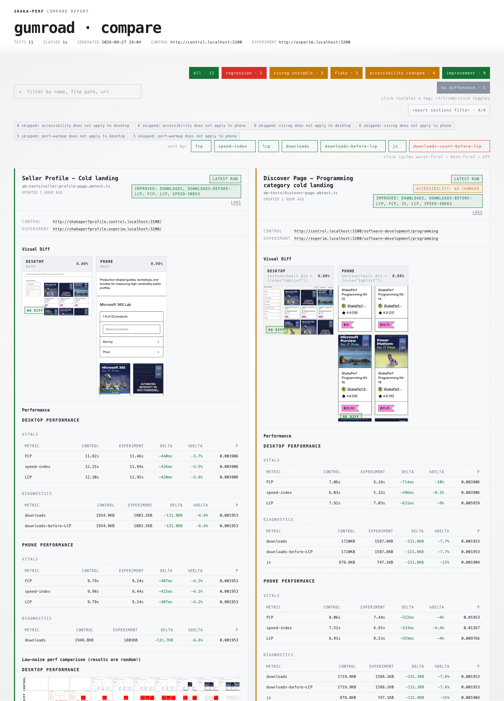
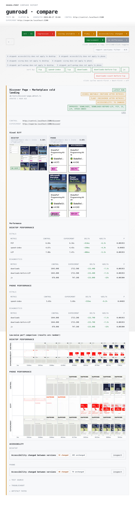

# ShakaPerf proof of concept: September 27, 2026

This snapshot preserves the local comparison of Gumroad pages before and after the loading-path optimization in [`a594e99aa7`](https://github.com/shakacode/gumroad/commit/a594e99aa7). The report compares control and experiment servers for Discover, Product, and seller Profile pages. The report does not record the exact Git SHA of either running server, so `a594e99aa7` identifies the change under test, not a verified container image SHA.

Open the [self-contained report](self-contained-performance-report.html) locally for the interactive comparison. GitHub can show the file as source, but does not run its report UI. The [`raw-perf`](raw-perf) files hold metric estimates and significance flags for all 22 viewport cases. The [`raw-measurements`](raw-measurements) files hold the paired samples. Each case has 10 control and 10 experiment samples.

## Result

| Page group     | Cold transfer reduction | Typical FCP/LCP change |
| -------------- | ----------------------: | ---------------------: |
| Discover       | 7.1–7.7% (about 132 KB) |           4–10% faster |
| Product        | 4.8–4.9% (about 132 KB) |            3–5% faster |
| Seller Profile |     6.8% (about 132 KB) |            3–4% faster |

Warm loads were also faster in most cases: about 4–8% for Discover, 5% for the Product Discover layout, and 7% for seller Profile. The Product Profile layout was 5–6% faster in the measured medians, but this difference was not statistically significant. No meaningful CLS, TBT, or TTFB regression appeared. Product desktop CLS was about 0.001–0.002.

## Report preview

The screenshots below show the report interface from the self-contained HTML file. Open the images at full size to read the metric tables.

### Comparison overview

### Discover comparison

