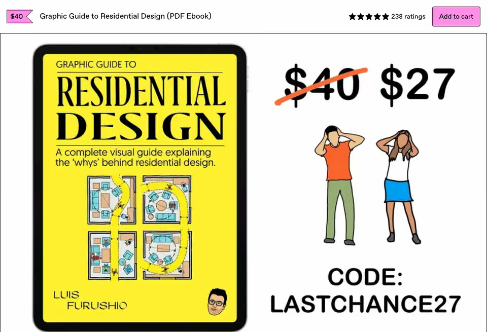
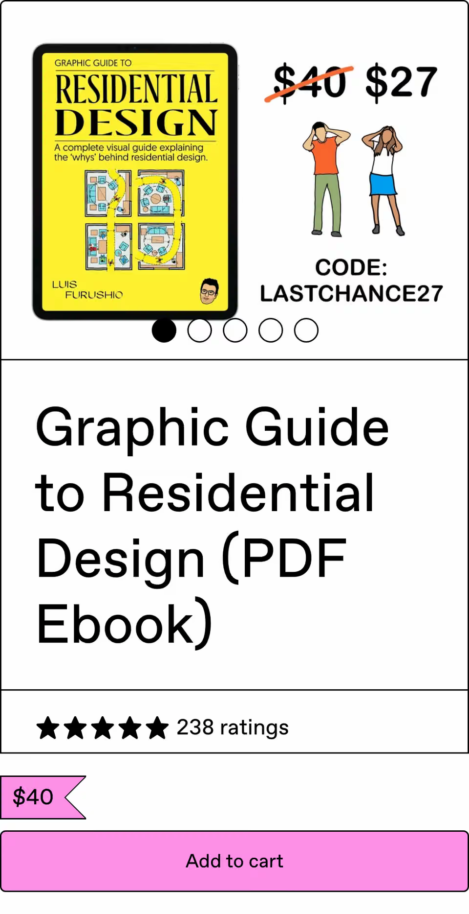

# Product RSC comparison: September 23, 2026

This is the latest local ShakaPerf report for the profile-layout Product page. It compares an Inertia control with a React on Rails Pro Server Components experiment. The run ID is `2026-09-23T18:01:58.195Z`; the report was generated at `2026-09-23T19:15:02.641Z`. It covers cold and warm desktop and phone landings, plus the phone sticky add-to-cart case. Each case has 20 samples per side.

| Landing      | Control FCP | Experiment FCP | Control LCP | Experiment LCP |
| ------------ | ----------: | -------------: | ----------: | -------------: |
| Cold desktop |      9.53 s |         1.16 s |      9.53 s |         2.05 s |
| Cold phone   |      9.54 s |         1.16 s |      9.54 s |         2.07 s |
| Warm desktop |      715 ms |         334 ms |      715 ms |         334 ms |
| Warm phone   |      708 ms |         326 ms |      708 ms |         326 ms |

Cold Product article screenshots had zero differing pixels on desktop and phone. Cold total transfer was about 125 KB (4.8%) higher on the experiment, while total blocking time rose from about 11–12 ms to 119–121 ms. The sticky add-to-cart case reported one new accessibility finding. Warm cases passed after retries. Review those limits with the paint improvements.

The report does not record immutable Git SHAs for its running servers. The `run-provenance.json` in the source directory is dated September 8 and belongs to another run; it does not establish the September 23 commits. The report was generated before the current `ramez/rorp/product-page-components` head, `ba3ad56f64a4190fd8f5096d93348e94c0d651b7`, was committed. This report is the latest local comparison, but a comparison with verified final-head source identities is still pending.

Open the [self-contained report](self-contained-performance-report.html) locally for the interactive view. The [full report](full-report.html), [report data](report.json), and [`raw`](raw) case files preserve the metrics and paired samples. The cold Product screenshots below were extracted from the self-contained report.

| Viewport | Inertia control                                                                             | RORP experiment                                                                             |
| -------- | ------------------------------------------------------------------------------------------- | ------------------------------------------------------------------------------------------- |
| Desktop  |  |  |
| Phone    |      |      |
