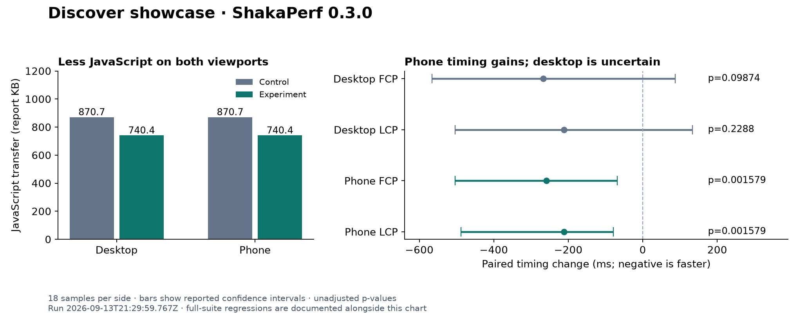

# Keep test dependencies off the buyer loading path

Exclude page tests from production entries and pin Vite's preload helper to the shared vendor chunk, based on [a594e99](https://github.com/antiwork/gumroad/commit/a594e99aa7a59836cd1675042ccd6073c8adabd3). Name Discover carousel buttons and use a valid category-navigation landmark. The shared benchmark foundation also covers the sticky add-to-cart journey into checkout.

## Full comparison results

ShakaPerf **0.3.0**, with project `shaka-shared` **0.3.0**. Run `2026-09-13T21:29:59.767Z` covers **14 scenarios / 27 viewport cases** without a filter or reused results.

The comparison **exited 1 with three performance regressions**. All engines completed without execution errors. Successful execution does not mean every metric improved:

- 25 performance cases, each with 18 samples per side; two dark-theme cases intentionally skip performance.
- 25 additional trace/Lighthouse artifact pairs. These single-pair captures do not replace the 18-sample statistics.
- 15 visual comparisons: zero differing pixels, without retries. The 12 warm performance-only cases skip visual and accessibility checks.
- 15 accessibility comparisons: no new findings. Existing findings and metadata changes remain in the report; the pages are not accessibility-clean.

Standalone experiment audit run `2026-09-13T23:12:50.788Z` **exited 0**: all **27 audits and annotated timelines** completed without report errors. ShakaPerf 0.3.0 includes every registered scenario in audits, including both showcase themes. Optional AI-written summaries are empty because the Claude CLI is unavailable; measured results and videos are present.

## Discover showcase



The chart and tables describe light-mode `/software-development`. Transfer values use the report's KB units. Medians are independent sample medians; paired estimator changes are separate statistics.

| Metric              | Desktop control → experiment | Phone control → experiment |
| ------------------- | ---------------------------- | -------------------------- |
| Total transfer (KB) | 1,695.3 → 1,565.6            | 1,708.3 → 1,578.3          |
| JavaScript (KB)     | 870.7 → 740.4                | 870.7 → 740.4              |
| Requests            | 79 → 79                      | 79 → 79                    |
| FCP (ms)            | 7,126 → 6,623                | 8,973 → 8,886              |
| LCP (ms)            | 8,139 → 7,643                | 10,645 → 10,386            |

Phone FCP and LCP improved at the configured 0.05 significance level. Desktop timing confidence intervals cross zero, so this run does **not** establish a desktop timing improvement. All p-values are unadjusted across the many comparisons. JavaScript falls by 130.3 KB on both viewports; request counts remain 79. These measurements apply to the recorded fixtures, hardware, and throttle profile.

| Viewport | Metric | Paired change | Reported interval | p        |
| -------- | ------ | ------------- | ----------------- | -------- |
| desktop  | FCP    | -267ms        | -566ms to 87ms    | 0.09874  |
| desktop  | LCP    | -211ms        | -504ms to 133ms   | 0.2288   |
| phone    | FCP    | -259ms        | -504ms to -68ms   | 0.001579 |
| phone    | LCP    | -212ms        | -488ms to -79ms   | 0.001579 |

## Regressions to keep visible

| Case                                                      | Metric    | Paired change | Reported interval | p        |
| --------------------------------------------------------- | --------- | ------------- | ----------------- | -------- |
| Discover Page - Marketplace warm landing / phone          | downloads | +8.6KB        | 0.4KB to 17KB     | 0.001045 |
| Discover Page - Programming category warm landing / phone | downloads | +8KB          | 0KB to 8.6KB      | 0.02081  |
| Product Page - Profile layout sticky add to cart / phone  | TTFB      | +100ms        | 5ms to 371ms      | 0.04512  |

These are report classifications, not engine failures. In particular, checkout's paired TTFB estimate is +100 ms while its separate medians are 250 → 266 ms. Do not substitute subtraction of medians for the paired estimate. The programming-category transfer interval's lower bound is rounded to zero by the report. The results were not rerun to select a more favorable outcome.

## Visual and accessibility evidence

The screenshots below come from the full 0.3.0 comparison. Each showcase comparison removes one `aria-roles` finding and two `button-name` findings. Other accessibility findings remain, including findings whose captured metadata differs between sides.

| View           | Control                                                               | Experiment                                                               |
| -------------- | --------------------------------------------------------------------- | ------------------------------------------------------------------------ |
| Desktop light  | [Screenshot](../../qa-media/pr-55-discover-light-desktop-control.png) | [Screenshot](../../qa-media/pr-55-discover-light-desktop-experiment.png) |
| Desktop dark   | [Screenshot](../../qa-media/pr-55-discover-dark-desktop-control.png)  | [Screenshot](../../qa-media/pr-55-discover-dark-desktop-experiment.png)  |
| Phone light    | [Screenshot](../../qa-media/pr-55-discover-light-phone-control.png)   | [Screenshot](../../qa-media/pr-55-discover-light-phone-experiment.png)   |
| Phone dark     | [Screenshot](../../qa-media/pr-55-discover-dark-phone-control.png)    | [Screenshot](../../qa-media/pr-55-discover-dark-phone-experiment.png)    |
| Checkout phone | [Screenshot](../../qa-media/pr-55-checkout-control-phone.png)         | [Screenshot](../../qa-media/pr-55-checkout-experiment-phone.png)         |

[Discover walkthrough](../../qa-media/pr-55-discover-walkthrough.mp4) · [Checkout walkthrough](../../qa-media/pr-51-checkout-walkthrough.mp4). These videos are prior captures of the same functionality; they are not recordings of the full 0.3.0 run.

Checkout waits for Stripe's card field and Link button, mocks cart PATCH persistence, and stops at the payment form. It does not submit a payment. The benchmark-only Google Fonts CSP allowance, PayPal sandbox default, and narrow reCAPTCHA blocking keep this fixture usable. FCP and navigation TTFB are anchored to the initial product navigation; recording continues through checkout initialization. These are not payment-submission timings or standalone checkout-load measurements.

## Sources and validation

- Measured control: `66cf284d22c19ee89c18799fda1589f106250f45`.
- Measured experiment: `a19be248d5e6a2ab248ac43b81e8a3dc42cae1ea`.
- Host benchmark runtime: Node `v24.13.1`; desktop 1280 × 800 at DPR 1, phone 375 × 667 at DPR 3.
- DevTools throttling: 100 ms RTT, 2,700 Kbps upload/download, 200 ms request latency, 3× CPU slowdown. Paired samples run simultaneously.

Compiled application assets were reused because this follow-up changes the benchmark harness and runtime configuration, not application JavaScript. The updated Ruby CSP configuration and startup script were synchronized and both Rails servers restarted. Startup continues to seed fixtures without repeating `npm run setup` or asset precompilation. The exact image IDs and runtime checks are recorded in the evidence. Publishing this evidence changes the branch tip without changing the measured source behavior; the measured SHAs above remain the provenance for this run.

The earlier build audit showed that the Inertia entry's static graph shrank from 685,681 to 553,360 deterministic gzip bytes, and Discover's from 769,622 to 637,344. Those build figures describe the reused compiled assets; they are not fresh browser-transfer measurements. Neither built graph has a static PDF dependency here, so no PDF-removal saving is claimed.

Focused benchmark TypeScript checking, changed-file linting, and shell syntax checks passed. The application-wide typecheck has 30 existing diagnostics outside the benchmark changes. `test-confidence` could not run without its API key. No full application test suite was run. The bundle-boundary and Discover-navigation test files passed all three tests on the current dependency installation.

## Reproduce and inspect

Follow the [setup and agent lifecycle guide](../shakaperf-benchmark-twins.md) using separate cloned checkouts at the measured SHAs. Run from the experiment clone. `SHAKAPERF_CONTROL_DIR` overrides the default sibling `../gumroad-control`; `SHAKAPERF_EXPERIMENT_DIR` defaults to the current directory.

For audit screencasts, select FFmpeg 7 as described in the setup guide. The first audit attempt was stopped because FFmpeg 9.0.1 rejected the recorder’s `-vsync` option; its incomplete artifacts are excluded from the published rerun. Use matching port overrides for build, startup, and comparison. This run used:

```sh
export SHAKAPERF_CONTROL_PORT=3300 SHAKAPERF_EXPERIMENT_PORT=3400
export SHAKAPERF_CONTROL_S3_PORT=9200 SHAKAPERF_EXPERIMENT_S3_PORT=9201
shaka-perf compare --categories visreg,perf,accessibility
shaka-perf audit --categories audit
```

Open `compare-results/full-report.html` and `audit-results/full-report.html`. The audit command targets the experiment checkout. Its single-run metrics are diagnostics, not additional paired samples.

[All-case evidence index](evidence.json) · [Comparison part 1](evidence.zip) · [Part 2](evidence-part-2.zip) · [Part 3](evidence-part-3.zip) · [Part 4](evidence-part-4.zip) · [Comparison manifest](evidence.manifest.json) · [Audit part 1](audit-evidence.zip) · [Audit part 2](audit-evidence-part-2.zip) · [Audit manifest](audit-evidence.manifest.json) · [Chart SVG](showcase-comparison.svg).

Extract all four comparison parts into the same empty directory, and both audit parts into another empty directory. Open `full-report.html` inside each corresponding results folder. The manifests record file hashes. Archives retain the full generated artifacts rather than only the favorable cases.

## Performance coverage

Every row below has 18 samples per side. Deltas are paired estimators; statistical significance and full metric details are retained in the evidence index. Dark showcase cases are covered by visual/accessibility checks above and intentionally have no performance row.

| Scenario                                           | Viewport | FCP change | LCP change | JavaScript change |
| -------------------------------------------------- | -------- | ---------- | ---------- | ----------------- |
| Discover Page - Marketplace cold landing           | desktop  | -664ms     | -501ms     | -130.3KB          |
| Discover Page - Marketplace cold landing           | phone    | -512ms     | -502ms     | -130.3KB          |
| Discover Page - Marketplace warm landing           | desktop  | -55ms      | -57ms      | 0KB               |
| Discover Page - Marketplace warm landing           | phone    | -65ms      | -64ms      | 0KB               |
| Discover Page - Programming category cold landing  | desktop  | -377ms     | -324ms     | -130.3KB          |
| Discover Page - Programming category cold landing  | phone    | -434ms     | -484ms     | -130.3KB          |
| Discover Page - Programming category warm landing  | desktop  | -54ms      | -50ms      | 0KB               |
| Discover Page - Programming category warm landing  | phone    | -61ms      | -73ms      | 0KB               |
| Discover showcase - light cold landing             | desktop  | -267ms     | -211ms     | -130.3KB          |
| Discover showcase - light cold landing             | phone    | -259ms     | -212ms     | -130.3KB          |
| Product Page - Discover layout cold landing        | desktop  | -452ms     | -452ms     | 0KB               |
| Product Page - Discover layout cold landing        | phone    | -623ms     | -623ms     | 0KB               |
| Product Page - Discover layout warm landing        | desktop  | -52ms      | -47ms      | 0KB               |
| Product Page - Discover layout warm landing        | phone    | -55ms      | -50ms      | 0KB               |
| Product Page - Profile layout cold landing         | desktop  | -542ms     | -543ms     | 0KB               |
| Product Page - Profile layout cold landing         | phone    | -779ms     | -779ms     | 0KB               |
| Product Page - Profile layout warm landing         | desktop  | -51ms      | -51ms      | 0KB               |
| Product Page - Profile layout warm landing         | phone    | -51ms      | -50ms      | 0KB               |
| Product Page - Profile layout sticky add to cart   | phone    | -457ms     | -462ms     | 0KB               |
| Seller Profile - Cold landing                      | desktop  | -581ms     | -582ms     | 0KB               |
| Seller Profile - Cold landing                      | phone    | -504ms     | -504ms     | 0KB               |
| Seller Profile - Warm landing                      | desktop  | -60ms      | -60ms      | 0KB               |
| Seller Profile - Warm landing                      | phone    | -55ms      | -55ms      | 0KB               |
| Seller Profile - Landing after product page warmup | desktop  | -47ms      | -47ms      | 0KB               |
| Seller Profile - Landing after product page warmup | phone    | -56ms      | -56ms      | 0KB               |
